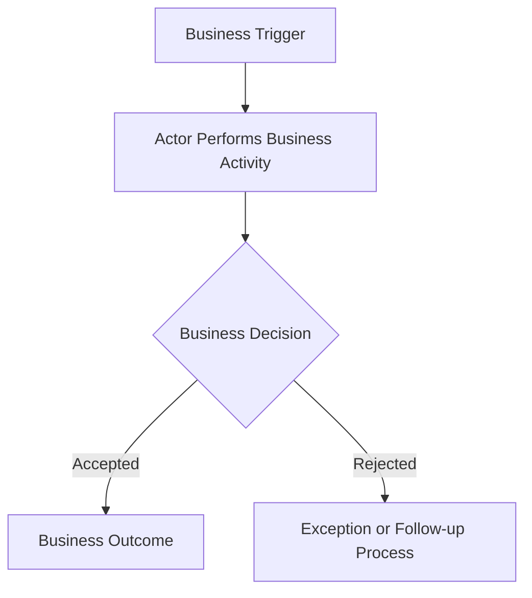
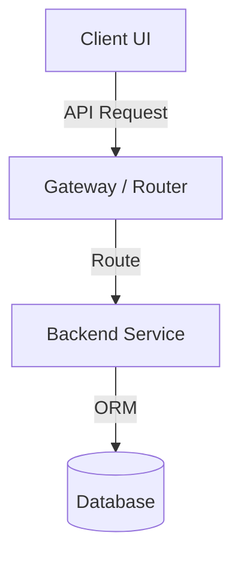
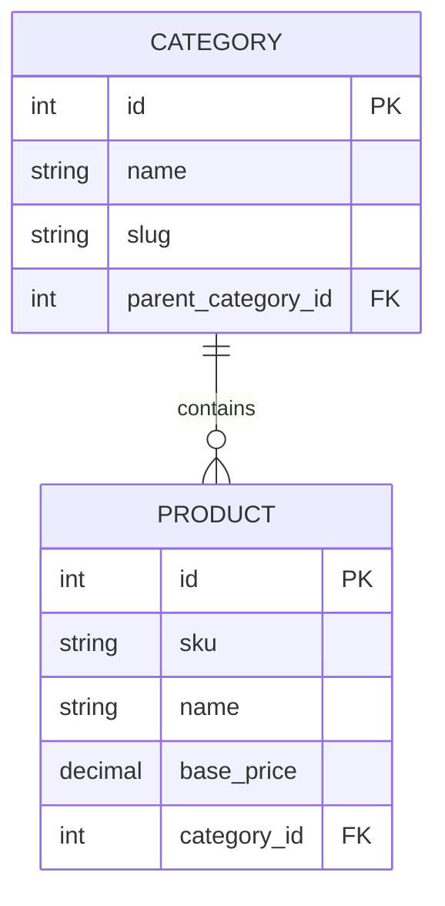
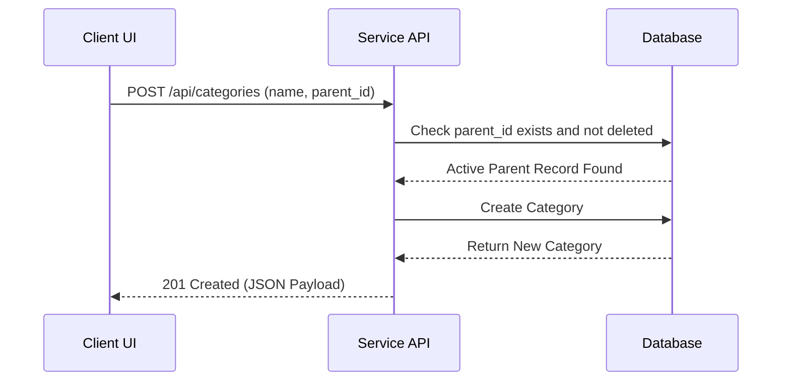

# Blueprint: Decoupled Specs & Distributed Roadmaps Documentation Approach
**Version:** 3
**Author:** [@mfauzanfikri](https://github.com/mfauzanfikri)

This document defines the standard requirements, structures, templates, and workflows for distributing documentation inside individual project services. Replicate this exact blueprint for all future services.

---

# 1. Objectives

The blueprint must:

* Preserve centralized specifications.
* Preserve distributed implementation tracking.
* Optimize for AI-assisted development.
* Improve requirement traceability.
* Improve onboarding experience.
* Improve analyst-to-developer handoff.
* Support long-term project maintenance.
* Improve brownfield adoption without inventing false requirement history.
* Make evidence quality and confidence visible where validation requires it.
* Enforce artifact boundaries, hierarchy, and temporal scope.
* Remain lightweight and practical.

The framework should avoid unnecessary enterprise process overhead.

---

# 2. Documentation Philosophy

## 2.1 The Blueprint (Specification Boundary)

Business and product specifications are isolated within a dedicated **Specification Boundary** (a separate repository for Pattern A, or `/docs/` directories for Patterns B and C).

The Specification Boundary serves as the source of truth for:

* Business requirements
* Product requirements
* User stories
* Architecture
* Requirement traceability
* Major decisions
* Project Version release history (Specs-level `CHANGELOG.md`)

The Specification Boundary must remain clean of codebase execution tracking artifacts. Under no circumstances may execution `ROADMAP.md` or codebase `CHANGELOG.md` files be placed inside the Specification Boundary, even when they reside in the same physical repository. The Specification Boundary permits only the Specs-level `CHANGELOG.md` to track Project Version release history of business capabilities.

---

## 2.2 The Execution Boundary

Implementation ownership and execution tracking remain within the **Execution Boundary** (whether a service codebase, a package subfolder, or a monolith root).

Implementation tracking must remain local to each execution boundary (e.g., at the service root or package root).

---

## 2.3 Master-Service Hierarchy

Master documentation owns business intent and product meaning.

Master documentation is responsible for:

```text
Why
What
```

Examples:

* Business objectives
* Business requirements
* Product requirements
* User requirements
* Acceptance criteria

Service-level documentation owns implementation context.

Service-level documentation is responsible for:

```text
How
```

Examples:

* APIs
* Routes
* Database implementation
* Service interactions
* Technical constraints

Service-level documents should reference or map to master requirements. They must not silently rewrite, fork, or duplicate master requirements as independent truth.

Service-level documentation may specialize, elaborate, and implement master requirements, but it must not:

* Redefine business requirements
* Introduce conflicting requirements
* Replace master-level intent

---

# 3. Documentation Blueprint Versioning

The Documentation Blueprint maintains its own version independent from project versions and service versions.

## Format

```text
1
2
3
```

---

## Rules

* Only major versions exist.
* Minor versions are intentionally not used.
* Patch versions are intentionally not used.
* Blueprint versions represent significant framework evolution.

---

## Examples

### Blueprint Version 1

* BRD
* User Stories
* Requirement Mapping

### Blueprint Version 2

* BRD
* PRD
* User Stories
* Architecture
* Requirement Mapping
* Decision Log
* Specs-level `CHANGELOG.md`
* Execution-boundary README, ROADMAP, and CHANGELOG standards

### Blueprint Version 3

* Project Context as temporary adoption input
* Evidence and confidence classification
* Central artifact contracts
* Traceability chain validation
* Master-service hierarchy rules
* Temporal scope rules
* Validation framework and finding lifecycle
* Brownfield adoption and business-flow discovery guidance

---

## Current Target

The active blueprint is assigned:

```text
Blueprint Version: 3
```

---

# 4. Project Context

Project Context is a temporary input artifact used before generating or revising blueprint artifacts.

It is:

* Temporary
* Non-authoritative
* Not maintained long-term by default
* Not a replacement for BRD, PRD, User Stories, Architecture, Requirement Mapping, Decision Log, or Specs-level CHANGELOG
* Retired after generated artifacts are validated and accepted, unless a project explicitly retains it as local working material

The blueprint standardizes Project Context purpose, structure, and expected content. It does not standardize filename, storage location, or generation method. Acceptable local names include `project-context.md`, `context.md`, `adoption-context.md`, and `migration-context.md`.

## 4.1 Purpose

Project Context normalizes system understanding before artifact generation.

It should help teams capture:

* Existing system behavior
* Known business workflows
* Source materials reviewed
* Explicit facts
* Derived facts
* Assumptions
* Unknowns
* Migration notes
* Confidence assessment

## 4.2 Brownfield Role

For existing projects, Project Context allows codebase-first documentation without inventing requirement history.

It must distinguish:

* What the system currently does
* What the business expects
* What documentation already claims
* What is inferred from implementation
* What remains unknown

Technical structures such as routes, services, APIs, entities, and tables are evidence inputs. They are not automatic business requirements.

---

# 5. Evidence and Confidence Classification

Evidence classification is mandatory in Project Context and validation findings.

Evidence classification is optional in final specification artifacts. Final artifacts should remain focused on communication and specification rather than evidence bookkeeping.

## 5.1 Classifications

| Classification | Meaning |
| :--- | :--- |
| Explicit Fact | Directly supported by source material or verified system behavior. |
| Derived Fact | Logical conclusion based on explicit facts. |
| Assumption | Plausible but not directly supported by evidence. |
| Unknown | Information is unavailable or unresolved. |

## 5.2 Confidence Levels

| Confidence | Meaning |
| :--- | :--- |
| High | Supported by direct evidence or repeated confirmation. |
| Medium | Supported by indirect evidence or reasonable derivation. |
| Low | Weakly supported, incomplete, or dependent on assumptions. |

## 5.3 Evidence Promotion

Rules for promoting information between evidence levels are intentionally deferred.

The framework recognizes the need for stronger evidence classification, but rules such as promoting `Observed in Code` to `Explicit Fact` or `Configured` to `Explicit Fact` require more field validation before becoming blueprint rules.

---

# 6. Repository & Workspace Structures

The framework supports three directory layout patterns depending on codebase architecture:

## Pattern A: Multi-Repository Layout (Decoupled Services)
Specs and codebase packages reside in physically separate Git repositories.

```text
my-service/
├── my-service-docs/       # [Specs] Specification Boundary (Repo A)
│   ├── 00_Documentation_Blueprint.md
│   ├── 01_BRD.md
│   ├── 02_PRD.md
│   ├── 03_User_Stories.md
│   ├── 04_Architecture.md
│   ├── 05_Requirement_Mapping.md
│   ├── 06_Decision_Log.md
│   └── CHANGELOG.md       # Specs-level Changelog (Project Version history)
│
├── my-service-backend/    # [Code] Execution Boundary (Repo B: Backend)
│   ├── README.md
│   ├── ROADMAP.md
│   └── CHANGELOG.md       # Codebase-level Changelog
│
└── my-service-frontend/   # [UI] Execution Boundary (Repo C: Frontend)
    ├── README.md
    ├── ROADMAP.md
    └── CHANGELOG.md       # Codebase-level Changelog
```

---

## Pattern B: Single-Repository Monorepo Layout
Specs and multiple codebase packages reside in a single repository.

```text
my-monorepo/ (Single Repository)
├── docs/                  # [Specs] Specification Boundary
│   ├── 00_Documentation_Blueprint.md
│   ├── 01_BRD.md
│   ├── 02_PRD.md
│   ├── 03_User_Stories.md
│   ├── 04_Architecture.md
│   ├── 05_Requirement_Mapping.md
│   ├── 06_Decision_Log.md
│   └── CHANGELOG.md       # Specs-level Changelog (Project Version history)
│
├── apps/
│   ├── backend/           # [Code] Execution Boundary (Backend Package)
│   │   ├── README.md
│   │   ├── ROADMAP.md
│   │   └── CHANGELOG.md   # Codebase-level Changelog
│   │
│   └── frontend/          # [UI] Execution Boundary (Frontend Package)
│       ├── README.md
│       ├── ROADMAP.md
│       └── CHANGELOG.md   # Codebase-level Changelog
│
├── ROADMAP.md             # Optional root-level cross-cutting execution tasks
├── CHANGELOG.md           # Optional root-level platform execution history
└── README.md              # Global Monorepo Guide
```

Workspace-level execution files (`ROADMAP.md` / `CHANGELOG.md` at the monorepo root) are optional and required only when there are cross-cutting workspace, CI/CD, or release coordination concerns.

---

## Pattern C: Single-Repository Monolith Layout
Specs and a single monolithic application codebase reside in a single repository.

```text
my-monolith/ (Single Repository)
├── docs/                  # [Specs] Specification Boundary
│   ├── 00_Documentation_Blueprint.md
│   ├── 01_BRD.md
│   ├── 02_PRD.md
│   ├── 03_User_Stories.md
│   ├── 04_Architecture.md
│   ├── 05_Requirement_Mapping.md
│   ├── 06_Decision_Log.md
│   └── CHANGELOG.md       # Specs-level Changelog (Project Version history)
│
├── src/                   # Monolith codebase source
├── README.md              # Codebase Guide & Tech Stack
├── ROADMAP.md             # [Code] Execution Boundary (Monolith Tracking)
└── CHANGELOG.md           # [Code] Execution Boundary (Monolith History)
```

---

## 6.4 Example Folder Naming Scope Protection

> [!IMPORTANT]
> The `v3-docs`, `v3-backend`, and `v3-frontend` folder naming is an **example-versioning convention only** for the central distributor repository references.
>
> Production repositories and active service directories must maintain their long-term generic names (e.g., `my-service-docs`, `my-service-backend`, `my-service-frontend` under Pattern A, or `docs`, `apps/backend`, `apps/frontend` under Pattern B).
>
> Production systems **must not** rename their repositories or folders to match the active blueprint version (e.g., changing `my-service-backend` to `v3-backend` is strictly prohibited). Doing so will break absolute paths, documentation references, external documentation links, and CI/CD automation pipelines.

---

# 7. Artifact Contracts

The Blueprint owns artifact contracts, scope boundaries, and ownership rules.

Templates provide implementation guidance and must not become a second source of truth for contract definitions.

Every artifact contract defines:

```yaml
purpose:
primary_question:
allowed_content:
forbidden_content:
dependencies:
temporal_scope:
authority_level:
```

## 7.1 BRD Contract

```yaml
purpose: Define business intent, stakeholders, scope, and success criteria.
primary_question: Why are we building this?
allowed_content:
  - Business objectives
  - Stakeholders
  - Scope and out-of-scope definitions
  - Business entities
  - High-level business flows and business flow diagrams
  - Business constraints
  - Success criteria
forbidden_content:
  - Detailed product behavior
  - Technical architecture
  - API sequence diagrams
  - API routes
  - Implementation tasks
  - Release history
dependencies:
  - Project Context when adopting brownfield systems
temporal_scope: Stable business intent for the current project version.
authority_level: Master business source of truth.
```

## 7.2 PRD Contract

```yaml
purpose: Define product capabilities, functional requirements, and user-facing behavior.
primary_question: What should the product do?
allowed_content:
  - Functional requirements
  - Product capabilities
  - User journeys and product interaction flows
  - References to BRD business flows when product behavior depends on them
  - Acceptance criteria summaries
  - Verified or explicitly provided UI/UX references
forbidden_content:
  - Business process ownership duplicated from BRD
  - Fabricated Figma, wireframe, prototype, or external design links
  - Placeholder URLs presented as real source material
  - Database schema ownership
  - API implementation details
  - Framework-specific design
  - Execution checklists
  - Code release history
dependencies:
  - BRD
  - Project Context when available
temporal_scope: Approved or proposed product scope for the current project version.
authority_level: Master product source of truth.
```

## 7.3 User Stories Contract

```yaml
purpose: Translate product requirements into implementable user-centered requirements.
primary_question: What requirements must be implemented?
allowed_content:
  - Stable story IDs
  - User stories
  - Acceptance criteria
  - Business rules
  - Edge cases
forbidden_content:
  - Technical task decomposition
  - Service-specific implementation criteria
  - Completed implementation status
  - Release evidence
dependencies:
  - BRD
  - PRD
temporal_scope: Requirement intent for the current project version.
authority_level: Master requirement source of truth.
```

## 7.4 Architecture Contract

```yaml
purpose: Define system design, boundaries, data relationships, and technical constraints.
primary_question: How is the system designed?
allowed_content:
  - System context and service boundaries
  - ERD diagrams
  - Sequence diagrams
  - Integration diagrams
  - High-level technical constraints
  - Technical design choices
forbidden_content:
  - New business requirements
  - Product scope changes
  - Roadmap checklists
  - Code release history
dependencies:
  - PRD
  - User Stories
authority_level: Master technical design source of truth.
temporal_scope: Approved technical direction for the current project version.
```

## 7.5 Requirement Mapping Contract

```yaml
purpose: Validate traceability between requirements, execution references, and release evidence.
primary_question: Did we miss anything?
allowed_content:
  - User Story IDs
  - Verification Criteria IDs
  - Execution boundaries
  - Relative links to ROADMAP or CHANGELOG anchors
  - Release evidence or pending state
forbidden_content:
  - Live checklist status duplication
  - Requirements rewritten from other artifacts
  - Implementation notes without traceability purpose
  - Unverified release claims
dependencies:
  - User Stories
  - Execution ROADMAP
  - Codebase CHANGELOG
temporal_scope: Current traceability state across planned and released work.
authority_level: Traceability index, not requirement source of truth.
```

## 7.6 Decision Log Contract

```yaml
purpose: Record significant product, architectural, and technical decisions.
primary_question: Why was this decision made?
allowed_content:
  - Decision status
  - Decision date
  - Context and problem statement
  - Options considered
  - Trade-offs
  - Decision outcome
forbidden_content:
  - Trivial implementation notes
  - Changelog entries
  - Roadmap tasks
  - Undated or statusless final decisions
dependencies:
  - BRD
  - PRD
  - Architecture
temporal_scope: State-sensitive decision history.
authority_level: Decision source of truth.
```

## 7.7 Specs-Level CHANGELOG Contract

```yaml
purpose: Record chronological release history of project business capabilities.
primary_question: What business capabilities changed in each project version?
allowed_content:
  - Planned specification scope under Unreleased or Planned
  - Released business capability entries
  - Business rule corrections
  - Product scope changes
forbidden_content:
  - Code-level bug fixes
  - Dependency updates
  - Internal refactors
  - Pending execution tasks presented as released
dependencies:
  - BRD
  - PRD
  - User Stories
  - Requirement Mapping
temporal_scope: State-sensitive project version history.
authority_level: Project capability release history.
```

## 7.8 Service README Contract

```yaml
purpose: Explain the execution boundary, local setup, technology stack, and documentation references.
primary_question: What is this service, package, or monolith?
allowed_content:
  - Service metadata
  - Service or package purpose
  - Implementation responsibilities
  - Technology stack mapping
  - Setup, build, test, and run instructions
  - Links to master documentation
forbidden_content:
  - Business requirements rewritten as local truth
  - Product acceptance criteria
  - Roadmap tasks
  - Release history
dependencies:
  - Specification Boundary documents
temporal_scope: Active execution-boundary operating guide.
authority_level: Service-level implementation guide.
```

Service metadata must include:

* Service / Package Name
* Execution Boundary
* Service Version
* Compatible Project Version
* Blueprint Version
* Release Status
* Owner / Maintainer

## 7.9 Execution ROADMAP Contract

```yaml
purpose: Track future-oriented implementation work within an execution boundary.
primary_question: What are we planning to build within this boundary?
allowed_content:
  - Stable Verification Criteria IDs
  - User Story ID references
  - Technical verification criteria
  - Pending or planned execution status
forbidden_content:
  - Completed historical work
  - Product requirements rewritten as local truth
  - Released changelog entries
  - Specification release history
dependencies:
  - User Stories
  - Architecture
  - Requirement Mapping
temporal_scope: State-sensitive future execution plan.
authority_level: Execution planning source for that boundary.
```

## 7.10 Codebase CHANGELOG Contract

```yaml
purpose: Record technical implementation history within an execution boundary.
primary_question: What has changed in this boundary?
allowed_content:
  - Technical implementation support
  - Code-level bug fixes
  - Refactors
  - Dependency changes
  - Removed code, routes, packages, or databases
forbidden_content:
  - Planned future work
  - Business capability release claims without implementation evidence
  - Product requirements rewritten as local truth
  - Specs-level release history
dependencies:
  - Execution ROADMAP
  - Requirement Mapping
temporal_scope: State-sensitive service/package version history.
authority_level: Execution-boundary implementation history.
```

---

# 8. Documentation Responsibilities

The following summaries are quick references. The artifact contracts in Section 7 remain the source of truth for artifact scope.

## 8.1 BRD

Purpose:

> Why are we building this?

Must contain:

* Business objectives
* Stakeholders
* Scope
* Out-of-scope definitions
* Business entities
* High-level business flows and business flow diagrams
* Business constraints
* Success criteria

Business flow diagrams should show actors, business decisions, handoffs, and outcomes. They must not include API routes, database calls, framework components, or implementation sequence details.

---

## 8.2 PRD

Purpose:

> What should the product do?

Must contain:

* Functional requirements
* Product capabilities
* User flows
* Product interaction flows
* References to BRD business flows where needed
* Acceptance criteria summary
* Verified or explicitly provided wireframe references
* Verified or explicitly provided Figma references
* Verified or explicitly provided prototype references

If design artifacts are unavailable, write `Not Provided` or `Unknown`. Do not fabricate Figma, wireframe, prototype, or external design links.

---

## 8.3 User Stories

Purpose:

> What requirements must be implemented?

Must contain:

* Story IDs
* User stories
* Acceptance criteria
* Business rules
* Edge cases

Standard format:

```text
As a ...
I want to ...
So that ...
```

---

## 8.4 Architecture

Purpose:

> How is the system designed?

Must contain:

* ERD diagrams
* Sequence diagrams
* System diagrams
* Integration diagrams
* Service boundaries
* Technical architecture decisions
* High-level technical constraints

No separate Data Model document should exist.

ERDs and Sequence Diagrams belong inside Architecture.

---

## 8.5 Requirement Mapping

Purpose:

> Did we miss anything?

To strictly preserve the Specification Boundary, the Requirement Mapping must not track execution checklist checkboxes or duplicate live implementation states. Instead, it serves as a static traceability index referencing stable execution IDs and release evidence.

### Mapping Matrix Standards
The Requirement Mapping file (`05_Requirement_Mapping.md`) must contain a traceability matrix with the following columns:

| User Story ID | Verification Criteria ID | Execution Boundary | Execution Reference | Release Evidence |
| :--- | :--- | :--- | :--- | :--- |
| `US-CAT-01` | `BE-US-CAT-01-001` | Backend | `[CHANGELOG.md](../my-service-backend/CHANGELOG.md#BE-US-CAT-01-001)` | `Service v1.0.0` |
| `US-CAT-01` | `BE-US-CAT-01-004` | Backend | `[ROADMAP.md](../my-service-backend/ROADMAP.md#BE-US-CAT-01-004)` | `Pending` |

* **User Story ID:** The unique story identifier from `03_User_Stories.md`.
* **Verification Criteria ID:** The stable, unique implementation ID defined in the service's `ROADMAP.md` (see Section 9.2 for format).
* **Execution Boundary:** The codebase where implementation occurs (e.g., `Backend`, `Frontend`, or `Monolith`).
* **Execution Reference:** A precise relative hyperlink to the criteria verification line.
  * For **active and incomplete tasks**, this must link to the codebase `ROADMAP.md#anchor`.
  * For **completed and released tasks**, this must link to the codebase `CHANGELOG.md#anchor` under the appropriate release version.
* **Release Evidence:** A record of implementation completeness.
  * For **completed tasks**, this must show a static record of completion (e.g., the first service/package version that included the implementation like `Service v1.0.0`, a specific pull request number like `PR #12`, or a Git commit hash).
  * For **incomplete/pending tasks**, this must be explicitly set to `Pending` (or `Planned`) and must not show completed release references.

### Traceability Chain Validation

Traceability validation must verify:

```text
ID
Valid Link
Correct Target
Supporting Evidence
Temporal State
```

Validation must confirm that:

* IDs are stable and unique.
* Links resolve to real targets.
* Targets represent the correct artifact type.
* Completed work links to static release evidence.
* Pending work links to active execution tracking.
* Evidence does not contradict the mapped requirement.

---

## 8.6 Decision Log

Purpose:

> Why was this decision made?

Must contain:

* Product decisions
* Architectural decisions
* Technical decisions
* Decision status
* Decision date
* Trade-offs

Examples:

* Soft delete vs hard delete
* Monolith vs microservices
* Event-driven vs synchronous processing

Avoid logging trivial implementation details.

---

## 8.7 Specs-level CHANGELOG.md

Purpose:

> What is the chronological release history of our project's business capabilities?

Must contain:

* The title `# Project Changelog - [Service Name] Specifications`.
* A dedicated `[Unreleased]` or `[Planned]` section at the top of the file to draft the target scope of upcoming releases.
* Chronological release entries formatted as `[MAJOR.MINOR] - YYYY-MM-DD` upon formal capability release approval.
* Wording organized in Keep a Changelog categories:
  * **Added:** New business features or capability modules.
  * **Changed:** Modifications to existing business processes, flowcharts, or rules.
  * **Fixed:** Strictly defined as **business or specification corrections** (e.g., correcting an incorrect business rule, fixing a flowchart gate error). Code-level bug fixes are strictly prohibited.
  * **Removed:** Deprecated or out-of-scope business capabilities.

---

# 9. Execution Boundary Standards

## 9.1 README.md
Purpose:
> What is this service, package, or monolith?
Must contain:
* Service metadata table
* Service/Package purpose and responsibilities
* Technology stack mapping table
* Local setup, build, and test execution instructions
* Related documentation references hyperlinking back to the Specification Boundary

Service README files must not redefine master business requirements.

---

## 9.2 ROADMAP.md

Purpose:

> What are we planning to build within this boundary?

Must contain an implementation-focused, strictly future-oriented task checklist. It tracks pending work and upcoming capabilities, not historical completions (which belong in the codebase `CHANGELOG.md`).

### Stable Verification Criteria ID Standard
Every checklist item (row) in the service `ROADMAP.md` must be assigned a unique, stable **Verification Criteria ID** to ensure accurate traceability without duplicating live checkbox statuses in the specifications.

#### ID Format
```text
[SERVICE_PREFIX]-[STORY_ID]-[CRITERIA_NUMBER]
```
* **`[SERVICE_PREFIX]`**: The identifier of the execution boundary. `BE` for Backend, `FE` for Frontend, or `ML` for Monolith.
* **`[STORY_ID]`**: The full User Story ID from the specification (e.g., `US-CAT-01`).
* **`[CRITERIA_NUMBER]`**: A unique three-digit sequential number starting at `001` (e.g., `001`, `002`, `003`).

#### Examples
* `BE-US-CAT-01-001` (Backend database schema creation verification)
* `BE-US-CAT-01-002` (Backend NestJS DTO validation verification)
* `FE-US-CAT-01-001` (Frontend TypeScript interfaces verification)

#### Constraints
1. **Uniqueness:** Verification Criteria IDs must be completely unique within a service's `ROADMAP.md`.
2. **Stability:** Once assigned, an ID is locked. If a roadmap task is deleted or modified, its ID **must not** be reused for a different task. This preserves the integrity of the Requirement Mapping references.

#### Table Format Example
```markdown
| Verification Criteria ID | User Story ID | Technical Verification Criteria | Status |
| :--- | :--- | :--- | :--- |
| `BE-US-CAT-01-001` | **US-CAT-01** | Create Prisma model `Category` with unique index on `slug` | `[ ]` |
| `BE-US-CAT-01-002` | **US-CAT-01** | Build `POST /api/categories` endpoint and check for slug uniqueness | `[ ]` |
```

---

## 9.3 CHANGELOG.md
Purpose:
> What has changed in this boundary?

Must comply with the following title and wording standards to prevent overlap with the high-level Specs CHANGELOG:

### Title Conventions
* **For Service/Package Boundaries:** `# Service Changelog - [Package Name] Codebase`.
* **For Monolith Boundaries:** `# Monolith Changelog - [Service Name] Codebase`.
* **For Optional Monorepo Root Platforms:** `# Platform Changelog - [Workspace Name] Workspace`.

### Wording & Content Standards
* **Implementation-Focused Entries:** All change logs in execution boundaries must record strictly technical implementations, rather than generic product milestones.
  * **Incorrect (Generic Product-Level):** `Added Category Management.`
  * **Correct (Implementation-Focused):** `Added implementation support for Category Management (Prisma models, NestJS DTO validation, and API routes).`
* **Categories:**
  * **Added:** Technical implementation support for new features/capabilities.
  * **Changed:** Technical optimizations, codebase refactorings, or package dependency upgrades.
  * **Fixed:** Code-level bug fixes, exception handling, and database runtime hotfixes.
  * **Removed:** Deprecated code files, routes, packages, or databases.

CHANGELOGs are historical records. Planned work belongs in `ROADMAP.md`.

---

# 10. Temporal Scope Rules

Temporal state is required only for state-sensitive artifacts.

State-sensitive artifacts include:

* ROADMAP
* CHANGELOG
* Decision Log
* Validation Findings

Temporal state is not required by default for non-state-sensitive specification artifacts such as:

* BRD
* PRD
* User Stories
* Architecture

## 10.1 Temporal States

| State | Meaning |
| :--- | :--- |
| Draft | Proposed but not yet accepted. |
| Planned | Accepted for future work but not implemented. |
| Active | Current source of truth for ongoing work. |
| Released | Completed and included in a formal release. |
| Historical | Preserved as past state or archive. |

## 10.2 Required Outcome

Blueprint v3 must prevent:

* Planned work from appearing in changelogs as completed history.
* Draft decisions from appearing as implemented decisions.
* Initialization work from appearing as released product capability.
* Pending execution tasks from being treated as release evidence.

---

# 11. Validation Framework

Validation is the enforcement layer for evidence, boundaries, traceability, hierarchy, and temporal scope.

Generation alone is not completion. Artifacts are usable only after validation findings are resolved or explicitly accepted.

## 11.1 Validation Areas

Blueprint v3 defines validation checks for:

* Purpose fit
* Boundary fit
* Evidence quality
* Traceability integrity
* Completeness
* Consistency
* Temporal correctness
* Master-service hierarchy

## 11.2 Finding Format

Validation findings should identify:

```yaml
finding:
affected_artifact:
problem_type:
evidence:
risk:
recommended_fix:
state:
```

## 11.3 Finding Lifecycle

| State | Meaning |
| :--- | :--- |
| Open | Finding exists and requires action. |
| Resolved | Finding has been addressed. |
| Accepted Risk | Finding remains but is intentionally accepted. |
| Rejected | Finding is determined to be invalid. |

---

# 12. Brownfield Adoption and Business Flow Discovery

When adopting an existing project, documentation must preserve uncertainty instead of inventing false history.

Adoption should identify:

* Business processes
* User journeys
* Operational workflows
* Actors and roles
* Triggering events
* State transitions
* External systems
* Known gaps and unknown intent

Routes, services, entities, APIs, database tables, and UI screens may support business-flow discovery. They must be treated as evidence inputs, not automatic product requirements.

If business intent cannot be proven from source material or verified behavior, record it as an assumption or unknown in Project Context and resolve it before presenting it as final requirement truth.

---

# 13. Development Workflow

```text
Business Need or Brownfield Adoption Trigger
|
Project Context (temporary input when needed)
|
BRD
|
PRD
|
User Stories
|
Architecture
|
Requirement Mapping
|
Specs CHANGELOG (Scope Planning under [Unreleased])
|
Service Roadmaps (Execution Boundary)
|
Implementation (Code & Tests)
|
Codebase CHANGELOG Updates (Execution Boundary)
|
Specs CHANGELOG (Capability Release Approval & Versioning)
|
Validation Findings Resolved or Accepted
```

Documentation must be created before implementation when greenfield work allows it. For brownfield adoption, documentation may start from observed implementation evidence, but final artifacts must distinguish evidence-backed facts from assumptions and unknowns.

---

# 14. AI-Assisted Development Principles

AI agents must:

1. Read Documentation Blueprint first.
2. Follow boundary structure.
3. Use documentation as the primary source of context.
4. Use Project Context when adopting or reconstructing existing systems.
5. Preserve evidence classification in Project Context and validation findings.
6. Use User Stories and Architecture as implementation guidance.
7. Update ROADMAPs in the Execution Boundary when technical tasks are planned or still pending.
8. Update codebase-level `CHANGELOG.md` files when code changes are implemented. AI agents must only update the Specs `CHANGELOG.md` if specifically instructed to publish a new Project Version release block.
9. Preserve traceability between requirements and implementation across the Specification and Execution Boundaries.
10. Validate purpose fit, boundary fit, evidence quality, traceability integrity, temporal correctness, and master-service hierarchy before considering artifacts complete.

The framework should optimize context quality rather than prompt complexity.

---

# 15. Analyst-to-Developer Handoff

Analysts primarily own the **Specification Boundary** (BRD, PRD, User Stories, mapping, decisions), while Developers primarily own the **Execution Boundary** (code, roadmaps, changelogs, READMEs). Both must preserve boundary responsibilities.

* **Analysts** establish the business objectives, functional specifications, and process flows.
* **Developers** translate approved user stories into technical criteria within execution boundaries, update traceability, and propose specification improvements.
* **AI agents** assist in translating approved specifications into structured implementation tasks across the boundary.

---

# 16. Project Versioning Strategy

## Philosophy
Project versions represent business and product capability evolution, decoupled from internal code refactorings or deployable revisions. In single-repository codebases (monorepos or monoliths), the Project Version represents the functional capabilities of the entire service ecosystem as a whole.

Project versions do not represent bug fixes, code refactoring, optimizations, or internal implementation details.

---

## Format
`MAJOR.MINOR` (e.g., `1.0`, `1.1`, `1.2`, `2.0`).

---

## Major Version
Increase when introducing significant business changes, major workflow redesigns, breaking product changes, or large scope expansions.

---

## Minor Version
Increase when introducing new feature modules or new business capabilities (e.g., Inventory Management, Reporting, Approval Workflows).

---

# 17. Version Hierarchy

The framework defines three independent version layers to prevent version lock:

## 17.1 Blueprint Version
Identifies the documentation framework standard (e.g., `Blueprint Version: 3`).

---

## 17.2 Project Version
Identifies the functional business capability release (e.g., `Project Version: 1.2`).

---

## 17.3 Service / Package Version
Identifies the deployable software revision within a specific execution boundary.

* **Format:** `MAJOR.MINOR.PATCH` (e.g., `1.2.15`).
* **Alignment Rule:** The first two segments (`MAJOR.MINOR`) **must align** with the Project Version they claim compatibility with. The third segment (`PATCH`) increments independently for bug fixes, dependency updates, and internal code refactorings.
* **Layout Mappings:**
  * **Pattern A (Multi-Repo) / Pattern B (Monorepo):** Each separate service codebase or monorepo package maintains its own independent Service Version (e.g., `Backend Version: 1.2.15`, `Frontend Version: 1.2.8`) aligning with their claimed Project Version compatibility.
  * **Pattern C (Monolith):** The single monolith codebase maintains a single Service Version (e.g., `1.2.15`) that aligns with its claimed Project Version compatibility.

---

## 17.4 Version Increments
Patch increments may include:
* Bug fixes
* Refactoring
* Performance improvements
* Dependency updates
* Internal technical changes

Patch changes must not alter the Project Version.

---

# 18. Constraints

Do not introduce additional permanent mandatory documentation artifacts beyond:

* BRD
* PRD
* User Stories
* Architecture
* Requirement Mapping
* Decision Log
* Specs-level `CHANGELOG.md`

Project Context is temporary by default and does not violate this mandatory artifact constraint.

Keep the framework lightweight.

Optimize for:

* Small teams
* AI-assisted development
* Analyst-to-developer handoff
* Long-term maintainability

Avoid unnecessary process overhead.

---

# 19. Reusable Roadmap Migration & Carry-Forward Rules

When transitioning active project documentation and local roadmaps to the current Blueprint standard:

## 19.1 Remove Completed Rows
Extract all completed items (marked `[x]`) from the service's `ROADMAP.md` file.

## 19.2 Backfill Codebase Changelog
* Record all completed implementations in the codebase `CHANGELOG.md` under the correct historical service/package version entry (the version in which they were actually released).
* **Cold-Start Rule:** If no codebase `CHANGELOG.md` existed before the migration, initialize it with a baseline version entry (e.g., `[1.0.0]`) and document all completed historical implementations under it using the implementation-focused wording standard.

## 19.3 Carry-Forward Incomplete Rows
* Carry forward all incomplete items (marked `[ ]`) into the current `ROADMAP.md`.
* Assign each carried-forward item a stable Verification Criteria ID (e.g., `BE-US-CAT-01-002`).
* Review all carried-forward tasks for validity against the updated specifications.

## 19.4 Validate Brownfield Evidence
* Use Project Context to separate explicit facts, derived facts, assumptions, and unknowns.
* Validate business-flow claims before moving them into BRD, PRD, or User Stories.
* Validate Requirement Mapping links and release evidence before treating migration as complete.

---

# 20. Core Specification & Execution Templates

To guarantee visual consistency and structure across services, all new and updated files must conform to the templates below. Artifact scope is governed by the contracts in Section 7.

## 20.1 Specification Boundary Templates

### 20.1.1 01_BRD.md
````markdown
# Business Requirements Document (BRD) - [Service Name]

## 1. Business Objectives & Goals
[Describe the business problem, business goals, and expected organizational value.]

## 2. Stakeholders & Roles
[List the business stakeholders, operational users, dependent teams, and external parties.]

## 3. Scope Boundaries

### In-Scope
* [Business capability or operational scope included.]

### Out-of-Scope
* [Business capability or operational scope excluded.]

## 4. Core Business Entities

### Entity A: [Entity Name]
[Business meaning of the entity and its business-critical attributes.]

## 5. Business Flow Diagrams

[Use Mermaid flowcharts or equivalent diagrams to show high-level business processes, actors, decisions, handoffs, and outcomes. Do not include API routes, database calls, framework components, or implementation sequence details.]



## 6. Business Constraints & Success Criteria
* **Constraint:** [Business limitation, policy, compliance expectation, or operational dependency.]
* **Success Criteria:** [Measurable business outcome.]
````

### 20.1.2 02_PRD.md
```markdown
# Product Requirements Document (PRD) - [Service Name]

## 1. Introduction & Product Goals
[Brief summary of the business problem being solved, who the users are, and high-level product value.]

## 2. Functional Requirements
[A structured list of functional requirements, categorized by feature area. Do not include database schema or API implementation details.]
* **FR-[MODULE]-[NUMBER]: [Feature Name]** - Detailed description of product behavior.
  * *Example:* **FR-CAT-01: Parent Category Assignment** - The system must allow users to assign a category to a parent category, creating a multi-level hierarchy up to 3 levels deep.

## 3. Product Capabilities & Scope
* **In-Scope:** [List of capabilities included in the current project phase.]
* **Out-of-Scope:** [List of capabilities explicitly excluded or deferred.]

## 4. User Journeys & Process Flows
[Textual descriptions or references to product interaction flows showing user behavior, screens, and product responses. Reference BRD business flow diagrams where product behavior supports a larger business process.]

## 5. UI/UX Figma & Wireframe References
* **Figma Project Link:** [Use only verified or explicitly provided links. If unavailable, write `Not Provided`.]
* **Wireframe / Prototype References:** [Use only verified or explicitly provided references. If unavailable, write `Not Provided`.]
* **Design Guidelines:** [List any specific UI system or layout constraints. If unavailable, write `Unknown`.]
```

### 20.1.3 04_Architecture.md
````markdown
# Technical Architecture - [Service Name]

## 1. System Context & Boundaries
[High-level overview of the service boundaries, how it fits into the global system, and dependency mappings. Do not introduce new business requirements here.]

## 2. Component Diagram


## 3. Entity Relationship Diagram (ERD)


## 4. Sequence Diagrams & Integration Flows


## 5. Technical Constraints & Design Choices
* **Database / ORM:** [e.g., PostgreSQL, Prisma ORM]
* **Validation Strategy:** [e.g., Class-validator DTO constraints]
* **Deletions:** [e.g., Strictly enforced soft-deletion using `deleted_at` timestamp]
````

### 20.1.4 06_Decision_Log.md
```markdown
# Architectural & Product Decisions - [Service Name]

## [ADR-001] [Decision Title]
* **Status:** [Draft | Proposed | Approved | Rejected | Superseded]
* **Date:** YYYY-MM-DD
* **Author:** [Name / Role]

### Context & Problem Statement
[Describe the context, technical challenge, or business constraint that requires a decision.]

### Options Considered
* **Option 1:** [Brief title / description]
* **Option 2:** [Brief title / description]

### Pros and Cons of Options
* **Option 1:**
  * (+) Pros: ...
  * (-) Cons: ...
* **Option 2:**
  * (+) Pros: ...
  * (-) Cons: ...

### Decision Outcome
* **Chosen Option:** [Option Name]
* **Justification:** [Why this option satisfies constraints better than others.]
* **Trade-offs:** [Acknowledge any compromises, security risks, or operational complexities accepted.]
```

### 20.1.5 Specs-level CHANGELOG.md
```markdown
# Project Changelog - [Service Name] Specifications

All notable changes to the functional and business specifications for the **[Service Name]** will be documented in this file.

This project tracks functional specs capabilities via **Project Versions (`MAJOR.MINOR`)**.

---

## [Unreleased]
### Added
* [Draft of planned feature additions]
### Changed
* [Draft of planned workflow modifications]
### Fixed
* [Draft of planned business rule corrections. Code bug fixes are strictly prohibited.]

---

## [1.0] - YYYY-MM-DD
### Added
* Initial baseline functional specifications for [Service Name] (BRD, PRD, User Stories, Architecture, and Mapping).
```

---

## 20.2 Execution Boundary Templates

### 20.2.1 Service README.md
````markdown
# [Service/Package Name]

## 1. Service Metadata
| Field | Value |
| :--- | :--- |
| Service / Package Name | [Service or package name] |
| Execution Boundary | [Backend Service | Frontend UI | Monolith | Package | Workspace] |
| Service Version | [MAJOR.MINOR.PATCH, e.g., 1.0.0] |
| Compatible Project Version | [MAJOR.MINOR, e.g., 1.0] |
| Blueprint Version | [Blueprint major version, e.g., 3] |
| Release Status | [Draft | Active | Stable | Deprecated | Archived] |
| Owner / Maintainer | [Team, role, or maintainer name] |

## 2. Overview & Purpose
[A clear description of this codebase boundary (backend, frontend, or monolith) and its implementation responsibilities. Reference master requirements instead of rewriting them.]

## 3. Technology Stack Mapping
| Layer | Technology | Purpose |
| :--- | :--- | :--- |
| Language | [e.g., TypeScript] | Type-safe development |
| Web Server | [e.g., NestJS / Express] | REST API engine |
| Database / ORM | [e.g., Prisma / PostgreSQL] | Data persistence |

## 4. Setup & Development Instructions
### Prerequisites
* Node.js version ...
* Database instance ...

### Quickstart Commands
```bash
# Install dependencies
npm install

# Start local server
npm run dev

# Run unit tests
npm run test
```

## 5. Documentation References
* **Documentation Blueprint:** [00_Documentation_Blueprint.md]([path-to-specs]/00_Documentation_Blueprint.md)
* **Product Requirements (PRD):** [02_PRD.md]([path-to-specs]/02_PRD.md)
* **Technical Architecture:** [04_Architecture.md]([path-to-specs]/04_Architecture.md)
* **Requirement Mapping:** [05_Requirement_Mapping.md]([path-to-specs]/05_Requirement_Mapping.md)

*Note: Replace `[path-to-specs]` with the actual relative path to the Specification Boundary directory (e.g., `../../docs/` in Pattern B or `../my-service-docs/` in Pattern A).*
````

### 20.2.2 Codebase CHANGELOG.md
```markdown
# Service Changelog - [Service Name] Codebase

All notable technical changes, optimizations, and bug fixes implemented in the **[Service Name]** codebase are recorded here.

This repository tracks codebase changes via **Service Versions (`MAJOR.MINOR.PATCH`)**.

---

## [1.0.0] - YYYY-MM-DD
### Added
* Initial technical codebase boilerplate setup.
* Prisma model database schemas and migration scripts.
* DTO input validations and API routing configurations.
```

---

## Metadata & Copyright

* **Framework:** Decoupled Specs & Distributed Roadmaps Framework
* **Current Version:** Version 3 (Major-only)
* **Author:** [@mfauzanfikri](https://github.com/mfauzanfikri)
* **License:** MIT
* **Copyright:** (c) 2026 mfauzanfikri. All rights reserved.
