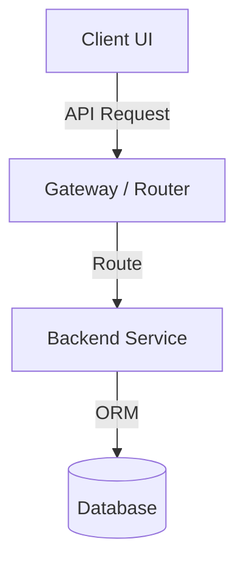
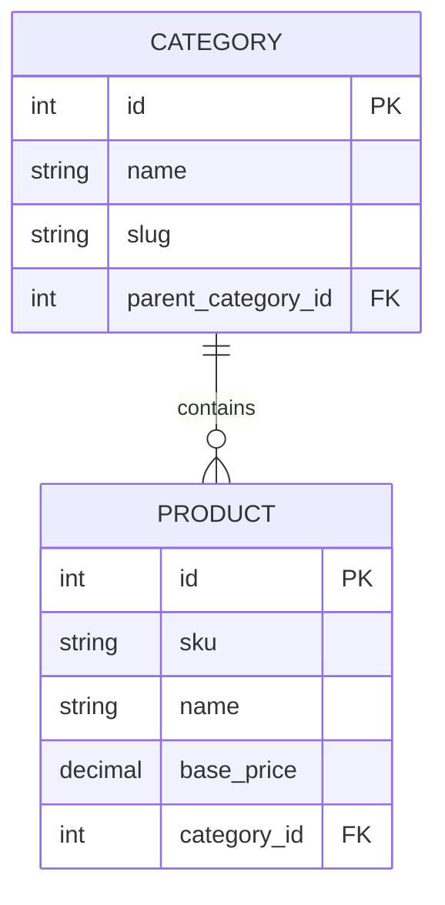
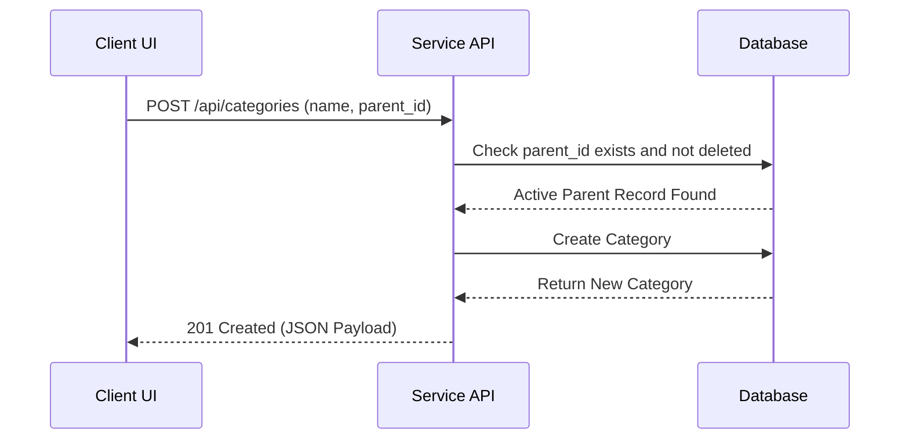

# Blueprint: Decoupled Specs & Distributed Roadmaps Documentation Approach
**Version:** 2  
**Author:** [@mfauzanfikri](https://github.com/mfauzanfikri)

This document defines the standard requirements, structures, templates, and workflows for distributing documentation inside individual project services. Replicate this exact blueprint for all future services.

---

# 1. Objectives

The revised blueprint must:

* Preserve centralized specifications.
* Preserve distributed implementation tracking.
* Optimize for AI-assisted development.
* Improve requirement traceability.
* Improve onboarding experience.
* Improve analyst-to-developer handoff.
* Support long-term project maintenance.
* Remain lightweight and practical.

The framework should avoid unnecessary enterprise process overhead.

---

# 2. Documentation Philosophy

## 2.1 The Blueprint (Specification Boundary)

Business and product specifications are isolated within a dedicated **Specification Boundary** (a separate repository for Pattern A, or `/docs/` directories for Patterns B and C).

The Specification Boundary serves as the source of truth for:

* Business requirements
* Product requirements
* User stories
* Architecture
* Requirement traceability
* Major decisions
* Project Version release history (Specs-level `CHANGELOG.md`)

The Specification Boundary must remain clean of codebase execution tracking artifacts. Under no circumstances may execution `ROADMAP.md` or codebase `CHANGELOG.md` files be placed inside the Specification Boundary, even when they reside in the same physical repository. The Specification Boundary permits only the Specs-level `CHANGELOG.md` to track Project Version release history of business capabilities.

---

## 2.2 The Execution (Execution Boundary)

Implementation ownership and execution tracking remain within the **Execution Boundary** (whether a service codebase, a package subfolder, or a monolith root).

Implementation tracking must remain local to each execution boundary (e.g., at the service root or package root).

---

# 3. Documentation Blueprint Versioning

The Documentation Blueprint maintains its own version independent from project versions and service versions.

## Format

```text
1
2
3
```

---

## Rules

* Only major versions exist.
* Minor versions are intentionally not used.
* Patch versions are intentionally not used.
* Blueprint versions represent significant framework evolution.

---

## Examples

### Blueprint Version 1

* BRD
* User Stories
* Requirement Mapping

### Blueprint Version 2

* BRD
* PRD
* User Stories
* Architecture
* Requirement Mapping
* Decision Log
* Specs-level `CHANGELOG.md`

---

## Current Target

The upgraded blueprint must be assigned:

```text
Blueprint Version: 2
```

---

# 4. Repository & Workspace Structures

The framework supports three directory layout patterns depending on codebase architecture:

## Pattern A: Multi-Repository Layout (Decoupled Services)
Specs and codebase packages reside in physically separate Git repositories.

```text
my-service/
├── my-service-docs/       # [Specs] Specification Boundary (Repo A)
│   ├── 00_Documentation_Blueprint.md
│   ├── 01_BRD.md
│   ├── 02_PRD.md
│   ├── 03_User_Stories.md
│   ├── 04_Architecture.md
│   ├── 05_Requirement_Mapping.md
│   ├── 06_Decision_Log.md
│   └── CHANGELOG.md       # Specs-level Changelog (Project Version history)
│
├── my-service-backend/    # [Code] Execution Boundary (Repo B: Backend)
│   ├── README.md
│   ├── ROADMAP.md
│   └── CHANGELOG.md       # Codebase-level Changelog
│
└── my-service-frontend/   # [UI] Execution Boundary (Repo C: Frontend)
    ├── README.md
    ├── ROADMAP.md
    └── CHANGELOG.md       # Codebase-level Changelog
```

---

## Pattern B: Single-Repository Monorepo Layout
Specs and multiple codebase packages reside in a single repository.

```text
my-monorepo/ (Single Repository)
├── docs/                  # [Specs] Specification Boundary
│   ├── 00_Documentation_Blueprint.md
│   ├── 01_BRD.md
│   ├── 02_PRD.md
│   ├── 03_User_Stories.md
│   ├── 04_Architecture.md
│   ├── 05_Requirement_Mapping.md
│   ├── 06_Decision_Log.md
│   └── CHANGELOG.md       # Specs-level Changelog (Project Version history)
│
├── apps/
│   ├── backend/           # [Code] Execution Boundary (Backend Package)
│   │   ├── README.md
│   │   ├── ROADMAP.md
│   │   └── CHANGELOG.md       # Codebase-level Changelog
│   │
│   └── frontend/          # [UI] Execution Boundary (Frontend Package)
│       ├── README.md
│       ├── ROADMAP.md
│       └── CHANGELOG.md       # Codebase-level Changelog
│
├── ROADMAP.md             # Optional root-level cross-cutting execution tasks
├── CHANGELOG.md           # Optional root-level platform execution history
└── README.md              # Global Monorepo Guide
```
*Note: Workspace-level execution files (ROADMAP.md / CHANGELOG.md at the monorepo root) are optional and required only when there are cross-cutting workspace/CI/CD concerns.*

---

## Pattern C: Single-Repository Monolith Layout
Specs and a single monolithic application codebase reside in a single repository.

```text
my-monolith/ (Single Repository)
├── docs/                  # [Specs] Specification Boundary
│   ├── 00_Documentation_Blueprint.md
│   ├── 01_BRD.md
│   ├── 02_PRD.md
│   ├── 03_User_Stories.md
│   ├── 04_Architecture.md
│   ├── 05_Requirement_Mapping.md
│   ├── 06_Decision_Log.md
│   └── CHANGELOG.md       # Specs-level Changelog (Project Version history)
│
├── src/                   # Monolith codebase source
├── README.md              # Codebase Guide & Tech Stack
├── ROADMAP.md             # [Code] Execution Boundary (Monolith Tracking)
└── CHANGELOG.md           # [Code] Execution Boundary (Monolith History)
```

---

## 4.4 Example Folder Naming Scope Protection

> [!IMPORTANT]
> The `v2-docs`, `v2-backend`, and `v2-frontend` folder naming is an **example-versioning convention only** for the central distributor repository references. 
> 
> Production repositories and active service directories must maintain their long-term generic names (e.g., `my-service-docs`, `my-service-backend`, `my-service-frontend` under Pattern A, or `docs`, `apps/backend`, `apps/frontend` under Pattern B). 
> 
> Production systems **must not** rename their repositories or folders to match the active blueprint version (e.g., changing `my-service-backend` to `v2-backend` is strictly prohibited). Doing so will break absolute paths, documentation references, external documentation links, and CI/CD automation pipelines.

---

# 5. Documentation Responsibilities

## 5.1 BRD

Purpose:

> Why are we building this?

Must contain:

* Business objectives
* Stakeholders
* Scope
* Out-of-scope definitions
* Business entities
* Business constraints
* Success criteria

---

## 5.2 PRD

Purpose:

> What should the product do?

Must contain:

* Functional requirements
* Product capabilities
* User flows
* Business process flows
* Acceptance criteria summary
* Wireframe references
* Figma references
* Prototype references

---

## 5.3 User Stories

Purpose:

> What requirements must be implemented?

Must contain:

* Story IDs
* User stories
* Acceptance criteria
* Business rules
* Edge cases

Standard format:

```text
As a ...
I want to ...
So that ...
```

---

## 5.4 Architecture

Purpose:

> How is the system designed?

Must contain:

* ERD diagrams
* Sequence diagrams
* System diagrams
* Integration diagrams
* Service boundaries
* Technical architecture decisions
* High-level technical constraints

No separate Data Model document should exist.

ERDs and Sequence Diagrams belong inside Architecture.

---

## 5.5 Requirement Mapping

Purpose:

> Did we miss anything?

To strictly preserve the Specification Boundary, the Requirement Mapping must not track execution checklist checkboxes or duplicate live implementation states. Instead, it serves as a static traceability index referencing stable execution IDs and release evidence.

### Mapping Matrix Standards
The Requirement Mapping file (`05_Requirement_Mapping.md`) must contain a traceability matrix with the following columns:

| User Story ID | Verification Criteria ID | Execution Boundary | Execution Reference | Release Evidence |
| :--- | :--- | :--- | :--- | :--- |
| `US-CAT-01` | `BE-US-CAT-01-001` | Backend | `[CHANGELOG.md](../my-service-backend/CHANGELOG.md#BE-US-CAT-01-001)` | `Service v1.0.0` |
| `US-CAT-01` | `BE-US-CAT-01-004` | Backend | `[ROADMAP.md](../my-service-backend/ROADMAP.md#BE-US-CAT-01-004)` | `Pending` |

* **User Story ID:** The unique story identifier from `03_User_Stories.md`.
* **Verification Criteria ID:** The stable, unique implementation ID defined in the service's `ROADMAP.md` (see Section 6.2 for format).
* **Execution Boundary:** The codebase where implementation occurs (e.g., `Backend`, `Frontend`, or `Monolith`).
* **Execution Reference:** A precise relative hyperlink to the criteria verification line.
  * For **active and incomplete tasks**, this must link to the codebase `ROADMAP.md#anchor`.
  * For **completed and released tasks**, this must link to the codebase `CHANGELOG.md#anchor` under the appropriate release version.
* **Release Evidence:** A record of implementation completeness.
  * For **completed tasks**, this must show a static record of completion (e.g., the first service/package version that included the implementation like `Service v1.0.0`, a specific pull request number like `PR #12`, or a Git commit hash).
  * For **incomplete/pending tasks**, this must be explicitly set to `Pending` (or `Planned`) and must not show completed release references.

---

## 5.6 Decision Log

Purpose:

> Why was this decision made?

Must contain:

* Product decisions
* Architectural decisions
* Technical decisions
* Trade-offs

Examples:

* Soft delete vs hard delete
* Monolith vs microservices
* Event-driven vs synchronous processing

Avoid logging trivial implementation details.

---

## 5.7 Specs-level CHANGELOG.md

Purpose:

> What is the chronological release history of our project's business capabilities?

Must contain:

* The title `# Project Changelog - [Service Name] Specifications`.
* A dedicated `[Unreleased]` or `[Planned]` section at the top of the file to draft the target scope of upcoming releases.
* Chronological release entries formatted as `[MAJOR.MINOR] - YYYY-MM-DD` upon formal capability release approval.
* Wording organized in Keep a Changelog categories:
  * **Added:** New business features or capability modules.
  * **Changed:** Modifications to existing business processes, flowcharts, or rules.
  * **Fixed:** Strictly defined as **business or specification corrections** (e.g., correcting an incorrect business rule, fixing a flowchart gate error). *Code-level bug fixes are strictly prohibited.*
  * **Removed:** Deprecated or out-of-scope business capabilities.

---

# 6. Execution Boundary Standards

## 6.1 README.md
Purpose:
> What is this service, package, or monolith?
Must contain:
* Service/Package purpose & responsibilities
* Technology stack mapping table
* Local setup, build, and test execution instructions
* Related documentation references hyperlinking back to the Specification Boundary

---

## 6.2 ROADMAP.md

Purpose:

> What are we planning to build within this boundary?

Must contain an implementation-focused, strictly future-oriented task checklist. It tracks pending work and upcoming capabilities, not historical completions (which belong in the codebase `CHANGELOG.md`).

### Stable Verification Criteria ID Standard
Every checklist item (row) in the service `ROADMAP.md` must be assigned a unique, stable **Verification Criteria ID** to ensure accurate traceability without duplicating live checkbox statuses in the specifications.

#### ID Format
```text
[SERVICE_PREFIX]-[STORY_ID]-[CRITERIA_NUMBER]
```
* **`[SERVICE_PREFIX]`**: The identifier of the execution boundary. `BE` for Backend, `FE` for Frontend, or `ML` for Monolith.
* **`[STORY_ID]`**: The full User Story ID from the specification (e.g., `US-CAT-01`).
* **`[CRITERIA_NUMBER]`**: A unique three-digit sequential number starting at `001` (e.g., `001`, `002`, `003`).

#### Examples
* `BE-US-CAT-01-001` (Backend database schema creation verification)
* `BE-US-CAT-01-002` (Backend NestJS DTO validation verification)
* `FE-US-CAT-01-001` (Frontend TypeScript interfaces verification)

#### Constraints
1. **Uniqueness:** Verification Criteria IDs must be completely unique within a service's `ROADMAP.md`.
2. **Stability:** Once assigned, an ID is locked. If a roadmap task is deleted or modified, its ID **must not** be reused for a different task. This preserves the integrity of the Requirement Mapping references.

#### Table Format Example
```markdown
| Verification Criteria ID | User Story ID | Technical Verification Criteria | Status |
| :--- | :--- | :--- | :--- |
| `BE-US-CAT-01-001` | **US-CAT-01** | Create Prisma model `Category` with unique index on `slug` | `[ ]` |
| `BE-US-CAT-01-002` | **US-CAT-01** | Build `POST /api/categories` endpoint and check for slug uniqueness | `[ ]` |
```

---

## 6.3 CHANGELOG.md
Purpose:
> What has changed in this boundary?

Must comply with the following title and wording standards to prevent overlap with the high-level Specs CHANGELOG:

### Title Conventions
* **For Service/Package Boundaries:** `# Service Changelog - [Package Name] Codebase`.
* **For Monolith Boundaries:** `# Monolith Changelog - [Service Name] Codebase`.
* **For Optional Monorepo Root Platforms:** `# Platform Changelog - [Workspace Name] Workspace`.

### Wording & Content Standards
* **Implementation-Focused Entries:** All change logs in execution boundaries must record strictly technical implementations, rather than generic product milestones.
  * **Incorrect (Generic Product-Level):** `Added Category Management.`
  * **Correct (Implementation-Focused):** `Added implementation support for Category Management (Prisma models, NestJS DTO validation, and API routes).`
* **Categories:**
  * **Added:** Technical implementation support for new features/capabilities.
  * **Changed:** Technical optimizations, codebase refactorings, or package dependency upgrades.
  * **Fixed:** Code-level bug fixes, exception handling, and database runtime hotfixes.
  * **Removed:** Deprecated code files, routes, packages, or databases.

CHANGELOGs are historical records.
---

# 7. Development Workflow

```text
Business Need
↓
BRD
↓
PRD
↓
User Stories
↓
Architecture
↓
Requirement Mapping
↓
Specs CHANGELOG (Scope Planning under [Unreleased])
↓
Service Roadmaps (Execution Boundary)
↓
Implementation (Code & Tests)
↓
Codebase CHANGELOG Updates (Execution Boundary)
↓
Specs CHANGELOG (Capability Release Approval & Versioning)
```

Documentation must be created before implementation and maintained throughout the project lifecycle.

---

# 8. AI-Assisted Development Principles

AI agents must:

1. Read Documentation Blueprint first.
2. Follow boundary structure.
3. Use documentation as the primary source of context.
4. Use User Stories and Architecture as implementation guidance.
5. Update ROADMAPs in the Execution Boundary when technical tasks are completed.
6. Update codebase-level `CHANGELOG.md` files when code changes are implemented. AI agents must only update the Specs `CHANGELOG.md` if specifically instructed to publish a new Project Version release block.
7. Preserve traceability between requirements and implementation across the Specification and Execution Boundaries.

The framework should optimize context quality rather than prompt complexity.

---

# 9. Analyst-to-Developer Handoff

Analysts primarily own the **Specification Boundary** (BRD, PRD, User Stories, mapping, decisions), while Developers primarily own the **Execution Boundary** (code, roadmaps, changelogs, READMEs). Both must preserve boundary responsibilities.

* **Analysts** establish the business objectives, functional specifications, and process flows.
* **Developers** translate approved user stories into technical criteria within execution boundaries, update traceability, and propose specification improvements.
* **AI agents** assist in translating approved specifications into structured implementation tasks across the boundary.
---

# 10. Project Versioning Strategy

## Philosophy
Project versions represent business and product capability evolution, decoupled from internal code refactorings or deployable revisions. In single-repository codebases (monorepos or monoliths), the Project Version represents the functional capabilities of the entire service ecosystem as a whole.

Project versions do not represent bug fixes, code refactoring, optimizations, or internal implementation details.

---

## Format
`MAJOR.MINOR` (e.g., `1.0`, `1.1`, `1.2`, `2.0`).

---

## Major Version
Increase when introducing significant business changes, major workflow redesigns, breaking product changes, or large scope expansions.

---

## Minor Version
Increase when introducing new feature modules or new business capabilities (e.g., Inventory Management, Reporting, Approval Workflows).

---

# 11. Version Hierarchy

The framework defines three independent version layers to prevent version lock:

## 11.1 Blueprint Version
Identifies the documentation framework standard (e.g., `Blueprint Version: 2`).

---

## 11.2 Project Version
Identifies the functional business capability release (e.g., `Project Version: 1.2`).

---

## 11.3 Service / Package Version
Identifies the deployable software revision within a specific execution boundary.

* **Format:** `MAJOR.MINOR.PATCH` (e.g., `1.2.15`).
* **Alignment Rule:** The first two segments (`MAJOR.MINOR`) **must align** with the Project Version they claim compatibility with. The third segment (`PATCH`) increments independently for bug fixes, dependency updates, and internal code refactorings.
* **Layout Mappings:**
  * **Pattern A (Multi-Repo) / Pattern B (Monorepo):** Each separate service codebase or monorepo package maintains its own independent Service Version (e.g., `Backend Version: 1.2.15`, `Frontend Version: 1.2.8`) aligning with their claimed Project Version compatibility.
  * **Pattern C (Monolith):** The single monolith codebase maintains a single Service Version (e.g., `1.2.15`) that aligns with its claimed Project Version compatibility.

---

## 11.4 Version Increments
Patch increments may include:
* Bug fixes
* Refactoring
* Performance improvements
* Dependency updates
* Internal technical changes

Patch changes must not alter the Project Version.
---

# 12. Constraints

Do not introduce additional mandatory documentation artifacts beyond:

* BRD
* PRD
* User Stories
* Architecture
* Requirement Mapping
* Decision Log
* Specs-level `CHANGELOG.md`

Keep the framework lightweight.

Optimize for:

* Small teams
* AI-assisted development
* Analyst-to-developer handoff
* Long-term maintainability

Avoid unnecessary process overhead.

---

# 13. Reusable Roadmap Migration & Carry-Forward Rules

When transitioning active project documentation and local roadmaps from Version 1 to Version 2 standards:

## 13.1 Remove Completed Rows
Extract all completed items (marked `[x]`) from the service's `ROADMAP.md` file.

## 13.2 Backfill Codebase Changelog
* Record all completed implementations in the codebase `CHANGELOG.md` under the correct historical service/package version entry (the version in which they were actually released).
* **Cold-Start Rule:** If no codebase `CHANGELOG.md` existed before the migration, initialize it with a baseline version entry (e.g., `[1.0.0]`) and document all completed historical implementations under it using the implementation-focused wording standard.

## 13.3 Carry-Forward Incomplete Rows
* Carry forward all incomplete items (marked `[ ]`) into the new v2 `ROADMAP.md`.
* Assign each carried-forward item a stable Verification Criteria ID (e.g., `BE-US-CAT-01-002`).
* Review all carried-forward tasks for validity against the updated specifications.

---

# 14. Core Specification & Execution Templates

To guarantee absolute visual consistency and structure across services, all new and updated files must conform exactly to the templates below.

## 14.1 Specification Boundary Templates

### 14.1.1 02_PRD.md
```markdown
# Product Requirements Document (PRD) - [Service Name]

## 1. Introduction & Product Goals
[Brief summary of the business problem being solved, who the users are, and high-level product value.]

## 2. Functional Requirements
[A structured list of functional requirements, categorized by feature area.]
* **FR-[MODULE]-[NUMBER]: [Feature Name]** - Detailed description of product behavior.
  * *Example:* **FR-CAT-01: Parent Category Assignment** - The system must allow users to assign a category to a parent category, creating a multi-level hierarchy up to 3 levels deep.

## 3. Product Capabilities & Scope
* **In-Scope:** [List of capabilities included in the current project phase.]
* **Out-of-Scope:** [List of capabilities explicitly excluded or deferred.]

## 4. User Journeys & Process Flows
[Textual descriptions or references to workflow diagrams showing the user path or backend process flows.]

## 5. UI/UX Figma & Wireframe References
* **Figma Project Link:** [Provide link here]
* **Design Guidelines:** [List any specific UI system or layout constraints]
```

### 14.1.2 04_Architecture.md
````markdown
# Technical Architecture - [Service Name]

## 1. System Context & Boundaries
[High-level overview of the service boundaries, how it fits into the global system, and dependency mappings.]

## 2. Component Diagram


## 3. Entity Relationship Diagram (ERD)


## 4. Sequence Diagrams & Integration Flows


## 5. Technical Constraints & Design Choices
* **Database / ORM:** [e.g., PostgreSQL, Prisma ORM]
* **Validation Strategy:** [e.g., Class-validator DTO constraints]
* **Deletions:** [e.g., Strictly enforced soft-deletion using `deleted_at` timestamp]
````

### 14.1.3 06_Decision_Log.md
```markdown
# Architectural & Product Decisions - [Service Name]

## [ADR-001] [Decision Title]
* **Status:** [Proposed | Approved | Rejected | Superseded]
* **Date:** YYYY-MM-DD
* **Author:** [Name / Role]

### Context & Problem Statement
[Describe the context, technical challenge, or business constraint that requires a decision.]

### Options Considered
* **Option 1:** [Brief title / description]
* **Option 2:** [Brief title / description]

### Pros and Cons of Options
* **Option 1:**
  * (+) Pros: ...
  * (-) Cons: ...
* **Option 2:**
  * (+) Pros: ...
  * (-) Cons: ...

### Decision Outcome
* **Chosen Option:** [Option Name]
* **Justification:** [Why this option satisfies constraints better than others.]
* **Trade-offs:** [Acknowledge any compromises, security risks, or operational complexities accepted.]
```

### 14.1.4 Specs-level CHANGELOG.md
```markdown
# Project Changelog - [Service Name] Specifications

All notable changes to the functional and business specifications for the **[Service Name]** will be documented in this file.

This project tracks functional specs capabilities via **Project Versions (`MAJOR.MINOR`)**.

---

## [Unreleased]
### Added
* [Draft of planned feature additions]
### Changed
* [Draft of planned workflow modifications]
### Fixed
* [Draft of planned business rule corrections. Code bug fixes are strictly prohibited.]

---

## [1.0] - YYYY-MM-DD
### Added
* Initial baseline functional specifications for [Service Name] (BRD, PRD, User Stories, Architecture, and Mapping).
```

---

## 14.2 Execution Boundary Templates

### 14.2.1 Service README.md
````markdown
# [Service/Package Name]

## 1. Overview & Purpose
[A clear description of this codebase boundary (backend, frontend, or monolith) and its core business responsibilities.]

## 2. Technology Stack Mapping
| Layer | Technology | Purpose |
| :--- | :--- | :--- |
| Language | [e.g., TypeScript] | Type-safe development |
| Web Server | [e.g., NestJS / Express] | REST API engine |
| Database / ORM | [e.g., Prisma / PostgreSQL] | Data persistence |

## 3. Setup & Development Instructions
### Prerequisites
* Node.js version ...
* Database instance ...

### Quickstart Commands
```bash
# Install dependencies
npm install

# Start local server
npm run dev

# Run unit tests
npm run test
```

## 4. Documentation References
* **Documentation Blueprint:** [00_Documentation_Blueprint.md]([path-to-specs]/00_Documentation_Blueprint.md)
* **Product Requirements (PRD):** [02_PRD.md]([path-to-specs]/02_PRD.md)
* **Technical Architecture:** [04_Architecture.md]([path-to-specs]/04_Architecture.md)

*Note: Replace `[path-to-specs]` with the actual relative path to the Specification Boundary directory (e.g., `../../docs/` in Pattern B or `../my-service-docs/` in Pattern A).*
````

### 14.2.2 Codebase CHANGELOG.md
```markdown
# Service Changelog - [Service Name] Codebase

All notable technical changes, optimizations, and bug fixes implemented in the **[Service Name]** codebase are recorded here.

This repository tracks codebase changes via **Service Versions (`MAJOR.MINOR.PATCH`)**.

---

## [1.0.0] - YYYY-MM-DD
### Added
* Initial technical codebase boilerplate setup.
* Prisma model database schemas and migration scripts.
* DTO input validations and API routing configurations.
```

---

## 📄 Metadata & Copyright

* **Framework:** Decoupled Specs & Distributed Roadmaps Framework
* **Current Version:** Version 2 (Major-only)
* **Author:** [@mfauzanfikri](https://github.com/mfauzanfikri)
* **License:** MIT
* **Copyright:** © 2026 mfauzanfikri. All rights reserved.
