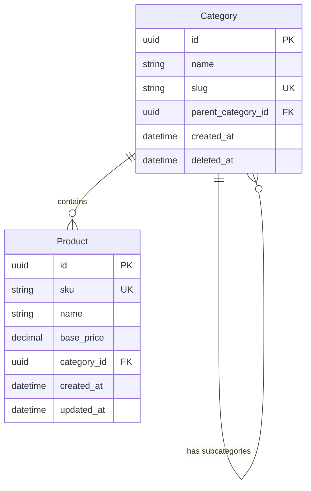
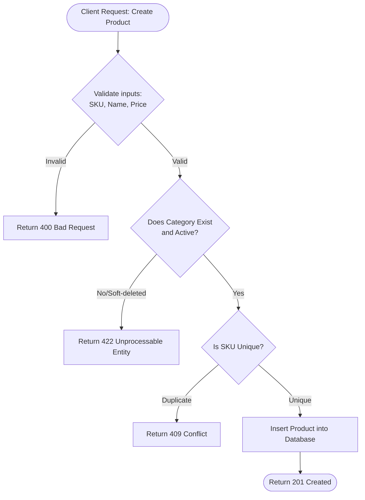

# Diagrams - Product Catalog Service
**Version:** 1.0 (Stable Milestone)

This document visualizes the database models and logical control flows for the Product Catalog Service.

---

## 1. Database Entity-Relationship Diagram (ERD)

The following diagram defines the relational data schema. A category can have a self-referencing relationship (subcategories) and a one-to-many relationship with products.

---

## 2. Product Creation Workflow

This flowchart maps the logical steps required during product creation, including boundary condition and category state checks.

