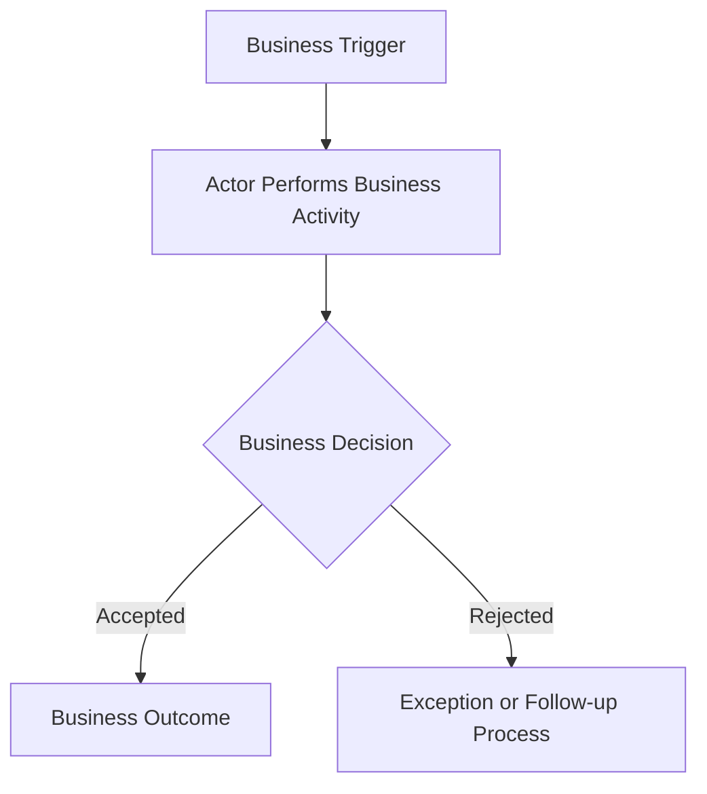
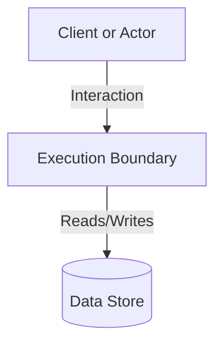
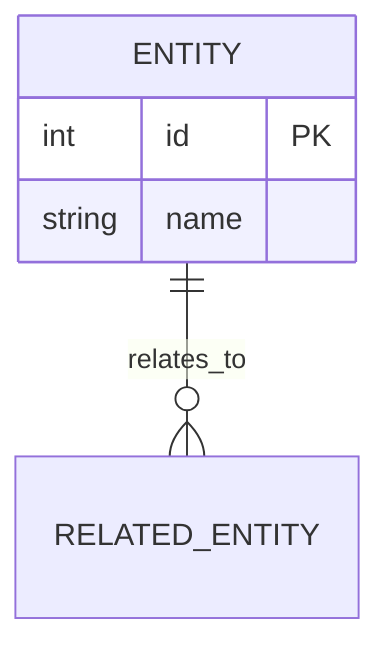

# Blueprint: Product-Centric Specs & Execution Boundary Documentation Approach
**Version:** 4
**Author:** [@mfauzanfikri](https://github.com/mfauzanfikri)

This document defines the standard requirements, structures, templates, and workflows for product-centric documentation with explicit execution boundary ownership. Replicate this blueprint for future projects that need clear specification boundaries, traceable implementation ownership, and lightweight governance.

---

# 1. Objectives

The blueprint must:

* Preserve centralized or explicitly distributed product specifications.
* Preserve local implementation ownership inside execution boundaries.
* Optimize for AI-assisted development.
* Improve requirement traceability across specification and execution boundaries.
* Support independent evolution of deployable boundaries.
* Support monorepos, multi-repository systems, monoliths, packages, and infrastructure boundaries without prescribing repository structure.
* Improve onboarding and analyst-to-developer handoff.
* Improve brownfield adoption without inventing false requirement history.
* Make evidence quality and confidence visible where validation requires it.
* Enforce artifact boundaries, hierarchy, and temporal scope.
* Remain lightweight and practical.

The framework standardizes concepts, responsibilities, relationships, and constraints. It does not standardize repository names, folder names, architecture styles, frameworks, deployment patterns, CI/CD tooling, infrastructure providers, or package managers.

---

# 2. Core Concepts

| Concept | Responsibility |
| :--- | :--- |
| Blueprint Version | Documentation framework evolution. |
| Product Version | Business and product capability evolution. |
| Specification Boundary | Business ownership and product intent. |
| Execution Boundary | Implementation ownership and execution tracking. |
| Boundary Version | Deployable revision lifecycle inside an execution boundary. |

Conceptual relationships:

```text
Blueprint Version

Product Version
    <-> compatible_with

Boundary Version
    <-> belongs_to

Execution Boundary
    <-> implements

Specification Boundary
```

Relationship rules:

* A Product Version may be implemented by multiple Execution Boundaries.
* An Execution Boundary may implement multiple Specification Boundaries.
* An Execution Boundary may have multiple Boundary Versions over time.
* A Boundary Version may declare compatibility with multiple Product Versions.
* Specification Boundaries may be centralized or distributed.
* Compatibility relationships are explicit and many-to-many when declared.

---

# 3. Documentation Philosophy

## 3.1 Specification Boundary

Business and product specifications are isolated within one or more **Specification Boundaries**.

A Specification Boundary serves as the source of truth for:

* Business requirements
* Product requirements
* User stories
* Architecture
* Requirement traceability
* Major decisions
* Product Version release history through the Specs-level `CHANGELOG.md`

The Specification Boundary must remain clean of execution tracking artifacts. Under no circumstances may execution `ROADMAP.md` or execution-boundary `CHANGELOG.md` files be placed inside a Specification Boundary, even when they reside in the same physical repository. The Specification Boundary permits only the Specs-level `CHANGELOG.md` to track Product Version release history of business capabilities.

## 3.2 Execution Boundary

Implementation ownership and execution tracking remain within the **Execution Boundary**.

Execution Boundaries are implementation ownership units such as a workspace, application, service, monolith, package, or infrastructure boundary. They are not required to match repository boundaries.

Implementation tracking must remain local to the execution boundary responsible for the work.

## 3.3 Specification and Execution Hierarchy

Specification documentation owns business intent and product meaning.

Specification documentation is responsible for:

```text
Why
What
```

Examples:

* Business objectives
* Business requirements
* Product requirements
* User requirements
* Acceptance criteria
* Product release history

Execution-boundary documentation owns implementation context.

Execution-boundary documentation is responsible for:

```text
How
Where
With what evidence
```

Examples:

* APIs
* Routes
* Database implementation
* Integration responsibilities
* Boundary-specific technical constraints
* Boundary release evidence

Execution-boundary documents should reference or map to specification requirements. They must not silently rewrite, fork, or duplicate specification requirements as independent truth.

---

# 4. Documentation Blueprint Versioning

The Documentation Blueprint maintains its own version independent from Product Versions and Boundary Versions.

## Format

```text
1
2
3
4
```

## Rules

* Only major versions exist.
* Minor versions are intentionally not used.
* Patch versions are intentionally not used.
* Blueprint versions represent significant framework evolution.

## Version History Summary

### Blueprint Version 1

* BRD
* User Stories
* Requirement Mapping

### Blueprint Version 2

* BRD
* PRD
* User Stories
* Architecture
* Requirement Mapping
* Decision Log
* Specs-level `CHANGELOG.md`
* Execution-boundary README, ROADMAP, and CHANGELOG standards

### Blueprint Version 3

* Project Context as temporary adoption input
* Evidence and confidence classification
* Central artifact contracts
* Traceability chain validation
* Master-service hierarchy rules
* Temporal scope rules
* Validation framework and finding lifecycle
* Brownfield adoption and business-flow discovery guidance

### Blueprint Version 4

* Product-centric version terminology
* Execution-boundary-centric ownership terminology
* Independent Boundary Versioning
* Execution Boundary classification
* Deployable and non-deployable boundary semantics
* Requirement ownership restrictions
* Distributed Specification Boundary namespace rules
* Documentation initialization guidance
* Explicit compatibility metadata governance

## Current Target

The active blueprint is assigned:

```text
Blueprint Version: 4
```

---

# 5. Documentation Initialization

Documentation initialization establishes topology and governance decisions before artifact generation.

Initialization is required for new V4 adoptions and recommended for V3 migrations. Existing V3 projects may adopt a minimal initialization record and enrich it incrementally.

Initialization captures:

* Repository organization approach
* Specification topology approach
* Adoption mode
* Execution boundary model
* Deployability characteristics
* Domain ownership model

Example:

```yaml
documentation_topology:
  repository_approach: implementation-defined
  specification_approach: centralized

adoption_mode: greenfield

execution_boundaries:
  - name: api
    type: service
    deployable: true
  - name: design-system
    type: package
    deployable: false
```

Initialization may be recorded in Project Context, an adoption context file, or another temporary planning artifact. It does not introduce a new permanent mandatory artifact.

---

# 6. Project Context

Project Context is a temporary input artifact used before generating or revising blueprint artifacts.

It is:

* Temporary
* Non-authoritative
* Not maintained long-term by default
* Not a replacement for BRD, PRD, User Stories, Architecture, Requirement Mapping, Decision Log, or Specs-level CHANGELOG
* Retired after generated artifacts are validated and accepted, unless a project explicitly retains it as local working material

The blueprint standardizes Project Context purpose, structure, and expected content. It does not standardize filename, storage location, or generation method. Acceptable local names include `project-context.md`, `context.md`, `adoption-context.md`, and `migration-context.md`.

## 6.1 Purpose

Project Context normalizes system understanding before artifact generation.

It should help teams capture:

* Existing system behavior
* Known business workflows
* Source materials reviewed
* Explicit facts
* Derived facts
* Assumptions
* Unknowns
* Migration notes
* Documentation topology
* Execution boundary model
* Confidence assessment

## 6.2 Brownfield Role

For existing projects, Project Context allows codebase-first documentation without inventing requirement history.

It must distinguish:

* What the system currently does
* What the business expects
* What documentation already claims
* What is inferred from implementation
* What remains unknown

Technical structures such as routes, services, APIs, entities, and tables are evidence inputs. They are not automatic business requirements.

---

# 7. Evidence and Confidence Classification

Evidence classification is mandatory in Project Context and validation findings.

Evidence classification is optional in final specification artifacts. Final artifacts should remain focused on communication and specification rather than evidence bookkeeping.

## 7.1 Classifications

| Classification | Meaning |
| :--- | :--- |
| Explicit Fact | Directly supported by source material or verified system behavior. |
| Derived Fact | Logical conclusion based on explicit facts. |
| Assumption | Plausible but not directly supported by evidence. |
| Unknown | Information is unavailable or unresolved. |

## 7.2 Confidence Levels

| Confidence | Meaning |
| :--- | :--- |
| High | Supported by direct evidence or repeated confirmation. |
| Medium | Supported by indirect evidence or reasonable derivation. |
| Low | Weakly supported, incomplete, or dependent on assumptions. |

## 7.3 Evidence Promotion

Rules for promoting information between evidence levels are intentionally deferred.

The framework recognizes the need for stronger evidence classification, but rules such as promoting `Observed in Code` to `Explicit Fact` or `Configured` to `Explicit Fact` require more field validation before becoming blueprint rules.

---

# 8. Documentation Topology

V4 supports multiple specification topology patterns:

* Centralized Specification Boundaries
* Domain-oriented Specification Boundaries
* Multi-repository execution boundaries
* Single-repository monorepos
* Single-repository monoliths

Topology selection must be driven by:

* Business ownership
* Domain boundaries
* Team responsibilities

Topology must not be driven by:

* Repository structure
* Directory layout
* Technology stack

Distributed specifications must support:

* Product-level requirement aggregation
* Product-level traceability reporting
* Product-level release visibility

## 8.1 Specification Boundary Namespace Rules

When multiple Specification Boundaries exist, product-level aggregation must preserve the originating specification context.

Canonical specification identities are:

```text
Specification Boundary + Requirement ID
Specification Boundary + User Story ID
```

Examples:

```text
Catalog::US-AUTH-01
Identity::US-AUTH-01
```

Global uniqueness is not required when namespace ownership is explicit.

## 8.2 Execution Boundary Model

Execution Boundaries are the primary implementation abstraction.

Standard boundary types:

```yaml
boundary_type:
  - workspace
  - application
  - service
  - monolith
  - package
  - infrastructure
```

Organizations may define additional boundary types when responsibilities, ownership rules, deployability, and traceability behavior are documented.

## 8.3 Deployability

Deployability determines release obligations.

```yaml
deployable: true | false
```

Only deployable boundaries require:

* Boundary Version
* Compatible Product Version declarations
* Boundary release evidence

Deployability does not determine whether a boundary contributes work.

## 8.4 Boundary Roles

| Role | Description |
| :--- | :--- |
| `requirement_owner` | Accountable for fulfilling a requirement. |
| `supporting_boundary` | Contributes implementation support. |
| `evidence_source` | Produces verification evidence. |

Rules:

* Only deployable boundaries may be `requirement_owner`.
* Deployable and non-deployable boundaries may be `supporting_boundary`.
* Deployable and non-deployable boundaries may be `evidence_source`.
* Requirement ownership must remain explicit.

Example:

```text
Requirement: User Authentication

Requirement Owner:
- api

Supporting Boundaries:
- shared-auth-library
- design-system

Evidence Sources:
- api
- shared-auth-library
```

## 8.5 Domain-Distributed Specification Structures

For workspaces containing multiple distinct business domains, the Specification Boundary may optionally be distributed across domain-specific folders rather than centralized in a single directory.

Rules for Domain-Distributed Structures:
* **Specification Boundaries**: Each domain-specific folder behaves as a distinct Specification Boundary. It may own its complete set of BRD, PRD, User Story, Architecture, mapping, decision log, and specifications CHANGELOG artifacts.
* **Namespace Scope**: Each domain specification folder owns its local User Story IDs. To prevent collisions across the workspace, canonical references and mappings must preserve the domain context using the `Specification Boundary + User Story ID` namespace pattern (e.g., `Inventory::US-SEC-01` vs. `Finance::US-SEC-01`).
* **Requirement Mapping**: Domain specifications may maintain individual domain-owned mapping files that resolve to shared execution boundaries.

## 8.6 Single Blueprint Authority

Except for the central blueprint distributor repository itself, an adopted repository workspace must maintain exactly one master copy of the blueprint framework.
* Exactly one `00_Documentation_Blueprint.md` is allowed per adopted repository workspace.
* Domain folders and individual specification directories must not duplicate the blueprint.
* All specification boundaries and execution boundaries within the workspace reference the single workspace-level blueprint.

---

# 9. Repository & Workspace Structures

The framework supports multiple layout patterns. These patterns describe relationship examples, not mandatory folder names.

## Pattern A: Multi-Repository Layout

Specifications and execution boundaries reside in physically separate repositories.

```text
my-product/
├── my-product-docs/       # [Specs] Specification Boundary
│   ├── 00_Documentation_Blueprint.md
│   ├── 01_BRD.md
│   ├── 02_PRD.md
│   ├── 03_User_Stories.md
│   ├── 04_Architecture.md
│   ├── 05_Requirement_Mapping.md
│   ├── 06_Decision_Log.md
│   └── CHANGELOG.md       # Specs-level Changelog (Product Version history)
│
├── my-product-api/        # [Code] Execution Boundary
│   ├── README.md
│   ├── ROADMAP.md
│   └── CHANGELOG.md       # Boundary implementation history
│
└── my-product-web/        # [UI] Execution Boundary
    ├── README.md
    ├── ROADMAP.md
    └── CHANGELOG.md       # Boundary implementation history
```

## Pattern B: Single-Repository Monorepo Layout

Specifications and multiple execution boundaries reside in a single repository.

```text
my-monorepo/
├── docs/                  # [Specs] Specification Boundary
│   ├── 00_Documentation_Blueprint.md
│   ├── 01_BRD.md
│   ├── 02_PRD.md
│   ├── 03_User_Stories.md
│   ├── 04_Architecture.md
│   ├── 05_Requirement_Mapping.md
│   ├── 06_Decision_Log.md
│   └── CHANGELOG.md       # Specs-level Changelog (Product Version history)
│
├── apps/
│   ├── api/               # Execution Boundary
│   │   ├── README.md
│   │   ├── ROADMAP.md
│   │   └── CHANGELOG.md
│   │
│   └── web/               # Execution Boundary
│       ├── README.md
│       ├── ROADMAP.md
│       └── CHANGELOG.md
│
├── ROADMAP.md             # Optional workspace execution roadmap
├── CHANGELOG.md           # Optional workspace execution history
└── README.md              # Global workspace guide
```

Workspace-level execution files are optional and required only when there are cross-cutting workspace, CI/CD, release coordination, or platform ownership concerns.

### Pattern B Variant: Domain-Distributed Specifications Workspace

For large monorepos with multiple business domains, specifications can be distributed into domain-owned specification folders under a single repository workspace. In this layout, the blueprint is centralized at the workspace level, while specifications are scoped to their respective domains.

```text
my-workspace/
├── docs/
│   ├── 00_Documentation_Blueprint.md  # Single Blueprint Authority
│   └── references/                     # Workspace References
│       ├── README.md
│       └── third_party_integration_specs.md
│
├── inventory/                          # Specification Boundary: Inventory
│   ├── 01_BRD.md
│   ├── 02_PRD.md
│   ├── 03_User_Stories.md
│   ├── 04_Architecture.md
│   ├── 05_Requirement_Mapping.md
│   ├── 06_Decision_Log.md
│   └── CHANGELOG.md
│
├── procurement/                        # Specification Boundary: Procurement
│   ├── 01_BRD.md
│   ├── 02_PRD.md
│   ├── 03_User_Stories.md
│   ├── 04_Architecture.md
│   ├── 05_Requirement_Mapping.md
│   ├── 06_Decision_Log.md
│   └── CHANGELOG.md
│
├── finance/                            # Specification Boundary: Finance
│   ├── 01_BRD.md
│   ├── 02_PRD.md
│   ├── 03_User_Stories.md
│   ├── 04_Architecture.md
│   ├── 05_Requirement_Mapping.md
│   ├── 06_Decision_Log.md
│   └── CHANGELOG.md
│
├── apps/
│   ├── api/                            # Execution Boundary
│   │   ├── README.md
│   │   ├── ROADMAP.md
│   │   └── CHANGELOG.md
│   │
│   └── web/                            # Execution Boundary
│       ├── README.md
│       ├── ROADMAP.md
│       └── CHANGELOG.md
│
├── README.md                           # Workspace-level guide
└── CHANGELOG.md                        # Workspace-level changelog
```

## Pattern C: Single-Repository Monolith Layout

Specifications and one deployable monolith boundary reside in a single repository.

```text
my-monolith/
├── docs/                  # [Specs] Specification Boundary
│   ├── 00_Documentation_Blueprint.md
│   ├── 01_BRD.md
│   ├── 02_PRD.md
│   ├── 03_User_Stories.md
│   ├── 04_Architecture.md
│   ├── 05_Requirement_Mapping.md
│   ├── 06_Decision_Log.md
│   └── CHANGELOG.md       # Specs-level Changelog (Product Version history)
│
├── src/
├── README.md              # Execution Boundary guide
├── ROADMAP.md             # Execution Boundary roadmap
└── CHANGELOG.md           # Execution Boundary history
```

## 9.4 Example Folder Naming Scope Protection

> [!IMPORTANT]
> Versioned folder names inside this central repository's `example/` directory are example-versioning conventions only.
>
> Production repositories and active directories should maintain durable product names and must not rename repositories or folders to match the active blueprint version. Doing so can break absolute paths, documentation references, external links, and automation pipelines.

---

# 10. Artifact Contracts

The Blueprint owns artifact contracts, scope boundaries, and ownership rules.

Templates provide implementation guidance and must not become a second source of truth for contract definitions.

Every artifact contract defines:

```yaml
purpose:
primary_question:
allowed_content:
forbidden_content:
dependencies:
temporal_scope:
authority_level:
```

## 10.1 BRD Contract

```yaml
purpose: Define business intent, stakeholders, scope, and success criteria.
primary_question: Why are we building this?
allowed_content:
  - Business objectives
  - Stakeholders
  - Scope and out-of-scope definitions
  - Business entities
  - Business-significant entity attributes
  - High-level business flows and business flow diagrams
  - Business constraints
  - Success criteria
forbidden_content:
  - Detailed product behavior
  - Technical architecture
  - Database schema fields
  - Technical persistence metadata
  - API sequence diagrams
  - API routes
  - Implementation tasks
  - Release history
dependencies:
  - Project Context when adopting brownfield systems
temporal_scope: Stable business intent for the current Product Version.
authority_level: Business source of truth.
```

## 10.2 PRD Contract

```yaml
purpose: Define product capabilities, functional requirements, and user-facing behavior.
primary_question: What should the product do?
allowed_content:
  - Functional requirements
  - Product capabilities
  - User journeys and product interaction flows
  - References to BRD business flows when product behavior depends on them
  - Acceptance criteria summaries
  - Verified or explicitly provided UI/UX references
forbidden_content:
  - Business process ownership duplicated from BRD
  - Fabricated Figma, wireframe, prototype, or external design links
  - Placeholder URLs presented as real source material
  - Database schema ownership
  - API implementation details
  - Framework-specific design
  - Execution checklists
  - Boundary release history
dependencies:
  - BRD
  - Project Context when available
temporal_scope: Approved or proposed product scope for the current Product Version.
authority_level: Product source of truth.
```

## 10.3 User Stories Contract

```yaml
purpose: Translate product requirements into implementable user-centered requirements.
primary_question: What requirements must be implemented?
allowed_content:
  - Stable story IDs
  - User stories
  - Acceptance criteria
  - Business rules
  - Edge cases
forbidden_content:
  - Technical task decomposition
  - Boundary-specific implementation criteria
  - Completed implementation status
  - Release evidence
dependencies:
  - BRD
  - PRD
temporal_scope: Requirement intent for the current Product Version.
authority_level: Requirement source of truth.
```

## 10.4 Architecture Contract

```yaml
purpose: Define system design, boundaries, data relationships, and technical constraints.
primary_question: How is the system designed?
allowed_content:
  - System context and execution boundaries
  - ERD diagrams
  - Sequence diagrams
  - Integration diagrams
  - Technical persistence metadata
  - Database identifiers, relationships, audit fields, and indexes
  - High-level technical constraints
  - Technical design choices
forbidden_content:
  - New business requirements
  - Product scope changes
  - Roadmap checklists
  - Boundary release history
dependencies:
  - PRD
  - User Stories
authority_level: Technical design source of truth.
temporal_scope: Approved technical direction for the current Product Version.
```

### Business vs Technical Attribute Boundary

BRD owns business-significant entity attributes: names, labels, identifiers meaningful to users or business processes, pricing, business state, business constraints, and other attributes required to explain business meaning.

Architecture owns technical persistence metadata: database IDs, foreign keys, audit timestamps, soft-delete fields, ORM or schema names, indexes, relationships, and storage-only implementation fields.

Technical attributes may appear in BRD only when they carry explicit business meaning. When included, the BRD must state the business meaning rather than presenting the attribute as database structure.

## 10.5 Requirement Mapping Contract

```yaml
purpose: Validate traceability between requirements, execution references, and release evidence.
primary_question: Did we miss anything?
allowed_content:
  - Specification Boundary identifiers when specifications are distributed
  - Requirement IDs
  - User Story IDs
  - Verification Criteria IDs
  - Execution Boundary names
  - Boundary roles
  - Relative links to ROADMAP or CHANGELOG anchors
  - Release evidence or pending state
  - Traceability validation findings
forbidden_content:
  - Live checklist status duplication
  - Requirements rewritten from other artifacts
  - Implementation notes without traceability purpose
  - Unverified release claims
  - Non-traceability validation findings
dependencies:
  - User Stories
  - Execution ROADMAP
  - Execution Boundary CHANGELOG
temporal_scope: Current traceability state across planned and released work.
authority_level: Traceability index, not requirement source of truth.
```

## 10.6 Decision Log Contract

```yaml
purpose: Record significant product, architectural, and technical decisions.
primary_question: Why was this decision made?
allowed_content:
  - Decision status
  - Decision date
  - Context and problem statement
  - Options considered
  - Trade-offs
  - Decision outcome
forbidden_content:
  - Trivial implementation notes
  - Changelog entries
  - Roadmap tasks
  - Undated or statusless final decisions
dependencies:
  - BRD
  - PRD
  - Architecture
temporal_scope: State-sensitive decision history.
authority_level: Decision source of truth.
```

## 10.7 Specs-Level CHANGELOG Contract

```yaml
purpose: Record chronological release history of product business capabilities.
primary_question: What business capabilities changed in each Product Version?
allowed_content:
  - Planned specification scope under Unreleased or Planned
  - Released business capability entries
  - Business rule corrections
  - Product scope changes
forbidden_content:
  - Code-level bug fixes
  - Dependency updates
  - Internal refactors
  - Pending execution tasks presented as released
dependencies:
  - BRD
  - PRD
  - User Stories
  - Requirement Mapping
temporal_scope: State-sensitive Product Version history.
authority_level: Product capability release history.
```

## 10.8 Execution Boundary README Contract

```yaml
purpose: Explain the execution boundary, deployability, compatibility, local setup, technology stack, and documentation references.
primary_question: What is this execution boundary and what does it own?
allowed_content:
  - Boundary metadata
  - Boundary purpose
  - Implementation responsibilities
  - Deployability classification
  - Compatible Product Version declarations for deployable boundaries
  - Technology stack mapping
  - Setup, build, test, and run instructions
  - Links to specification documentation
forbidden_content:
  - Business requirements rewritten as local truth
  - Product acceptance criteria
  - Roadmap tasks
  - Release history
dependencies:
  - Specification Boundary documents
temporal_scope: Active execution-boundary operating guide.
authority_level: Execution-boundary implementation guide.
```

Boundary metadata must include:

* Boundary Name
* Boundary Type
* Deployable
* Boundary Version when deployable
* Compatible Product Versions when deployable
* Blueprint Version
* Release Status
* Owner / Maintainer

Boundary metadata may include:

* Compatibility Status
* Compatibility Notes

## 10.9 Execution ROADMAP Contract

```yaml
purpose: Track future-oriented implementation work within an execution boundary.
primary_question: What are we planning to build within this boundary?
allowed_content:
  - Stable Verification Criteria IDs
  - User Story ID references
  - Technical verification criteria
  - Boundary role
  - Pending or planned execution status
forbidden_content:
  - Completed historical work
  - Product requirements rewritten as local truth
  - Released changelog entries
  - Specification release history
dependencies:
  - User Stories
  - Architecture
  - Requirement Mapping
temporal_scope: State-sensitive future execution plan.
authority_level: Execution planning source for that boundary.
```

Verification Criteria IDs are unique within an Execution Boundary. Global uniqueness is not required when the Execution Boundary namespace is explicit.

## 10.10 Execution Boundary CHANGELOG Contract

```yaml
purpose: Record technical implementation history within an execution boundary.
primary_question: What has changed in this boundary?
allowed_content:
  - Technical implementation support
  - Code-level bug fixes
  - Refactors
  - Dependency changes
  - Removed code, routes, packages, or databases
  - Boundary release evidence for deployable boundaries
forbidden_content:
  - Planned future work
  - Business capability release claims without implementation evidence
  - Product requirements rewritten as local truth
  - Specs-level release history
dependencies:
  - Execution ROADMAP
  - Requirement Mapping
temporal_scope: State-sensitive Boundary Version history.
authority_level: Execution-boundary implementation history.
```

## 10.11 Workspace References Contract

```yaml
purpose: Formal location for long-lived workspace references.
primary_question: What auxiliary reference materials support the specs?
allowed_content:
  - Technical manuals, hardware specifications, third-party API references, or external protocols.
  - Legacy system architecture diagrams or legacy workflow references.
  - Industry standards, compliance regulations, or policy definitions.
  - Long-lived onboarding guides, environmental configurations, or workspace guides.
forbidden_content:
  - Active product requirements or domain specifications.
  - Active user stories, active architecture details, or active business decision logs.
  - Target system designs, execution tasks, or active release records.
  - Temporary files, scratch pads, or draft notes.
dependencies:
  - None.
temporal_scope: Long-lived reference material.
authority_level: Explicitly non-authoritative. Reference documents must not override the master blueprint, must not override domain specifications, and must not become source-of-truth requirements.
```

---

# 11. Traceability Rules

Canonical verification identity:

```text
Execution Boundary + Verification Criteria ID
```

Verification Criteria IDs are namespace-scoped. Global uniqueness is not required.

All Execution Boundaries provide namespace scope for:

* Verification Criteria IDs
* ROADMAP ownership

Deployable Execution Boundaries additionally provide namespace scope for:

* CHANGELOG ownership
* Boundary Versions
* Boundary release evidence

Non-deployable boundaries may optionally maintain planning or change-tracking artifacts when useful for implementation coordination.

Requirement Mapping must preserve:

* Specification Boundary context when specifications are distributed
* Requirement or User Story ID
* Execution Boundary
* Boundary role
* Execution reference
* Release evidence or pending state

Example:

```markdown
| Specification Boundary | User Story ID | Verification Criteria ID | Execution Boundary | Boundary Role | Execution Reference | Release Evidence |
| :--- | :--- | :--- | :--- | :--- | :--- | :--- |
| Catalog | US-CAT-01 | API-US-CAT-01-001 | api | requirement_owner | [CHANGELOG.md](../api/CHANGELOG.md#API-US-CAT-01-001) | Boundary v1.0.0 |
| Catalog | US-CAT-01 | UI-US-CAT-01-001 | web | supporting_boundary | [ROADMAP.md](../web/ROADMAP.md#UI-US-CAT-01-001) | Pending |
```

---

# 12. Compatibility Metadata Governance

Compatibility declarations are explicit and do not require a new permanent mandatory artifact.

Current-state compatibility lives in each deployable Execution Boundary README metadata table.

Historical release evidence lives in the Execution Boundary CHANGELOG.

Product-level traceability lives in Requirement Mapping.

Required deployable boundary metadata:

```yaml
boundary_version:
compatible_product_versions:
```

Optional deployable boundary metadata:

```yaml
compatibility_status:
compatibility_notes:
```

Ownership rules:

* The Specification Boundary owns Product Versions and product release history.
* A deployable Execution Boundary owns its Boundary Version and compatibility declaration.
* Requirement Mapping owns product-level traceability across boundaries.
* Execution Boundary CHANGELOG entries provide historical release evidence.

Validation rules:

* Every deployable boundary must declare a Boundary Version.
* Every deployable boundary must declare compatible Product Versions.
* A Boundary Version referenced as release evidence must exist in that boundary's CHANGELOG.
* Requirement Mapping must not claim release evidence without a matching execution reference.
* Non-deployable boundaries must not be requirement owners or product release owners.
* Except for the central blueprint distributor repository, an adopted repository workspace must contain exactly one `00_Documentation_Blueprint.md` file. Duplicate Blueprint copies inside domain or subfolders are prohibited.
* Reference documents (e.g. inside `references/`) must remain non-authoritative. They must not override the master Blueprint or domain specifications, nor define source-of-truth requirement criteria.
* Mappings within a domain-distributed workspace must preserve the originating domain identity. Lost domain identity in mappings (e.g. omitting the Specification Boundary namespace prefix for User Story IDs) is prohibited.
* Temporary, scratch, or draft files must not be placed inside `references/`. The `references/` directory must only house long-lived reference material.

---

# 13. Validation Framework

Validation is the enforcement layer for evidence, boundaries, traceability, hierarchy, and temporal scope.

Generation alone is not completion. Artifacts are usable only after validation findings are resolved or explicitly accepted.

## 13.1 Validation Areas

Blueprint v4 defines validation checks for:

* Purpose fit
* Boundary fit
* Evidence quality
* Traceability integrity
* Completeness
* Consistency
* Temporal correctness
* Specification and execution hierarchy
* Deployability classification
* Compatibility metadata
* Blueprint authority verification
* Reference authority and content limits
* Domain namespace preservation

## 13.2 Finding Format

Validation findings should identify:

```yaml
finding:
affected_artifact:
problem_type:
evidence:
evidence_classification:
confidence:
risk:
recommended_fix:
state:
```

`evidence_classification` must use the Section 7.1 classification values, and `confidence` must use the Section 7.2 confidence values.

## 13.3 Finding Scope & Persistence

Validation findings may only be persisted within an artifact when the finding falls within that artifact's contract scope.

Persisted findings belong in the artifact being evaluated. For example, BRD findings belong in `01_BRD.md`, PRD findings belong in `02_PRD.md`, User Story findings belong in `03_User_Stories.md`, Architecture findings belong in `04_Architecture.md`, and Decision Log findings belong in `06_Decision_Log.md`.

`05_Requirement_Mapping.md` may only persist traceability-related findings, including missing or invalid story IDs, verification criteria IDs, execution boundaries, boundary roles, links, release evidence, temporal state, or contradictions in mapped evidence.

Validation findings that do not clearly belong to a specific artifact contract should remain temporary review output rather than permanent documentation content.

## 13.4 Finding Lifecycle

| State | Meaning |
| :--- | :--- |
| Open | Finding exists and requires action. |
| Resolved | Finding has been addressed. |
| Accepted Risk | Finding remains but is intentionally accepted. |
| Rejected | Finding is determined to be invalid. |

---

# 14. Brownfield Adoption and Migration

When adopting an existing project, documentation must preserve uncertainty instead of inventing false history.

Adoption should identify:

* Business processes
* User journeys
* Operational workflows
* Actors and roles
* Triggering events
* State transitions
* External systems
* Execution boundaries
* Deployability characteristics
* Known gaps and unknown intent

Routes, services, entities, APIs, database tables, infrastructure modules, packages, and UI screens may support business-flow discovery. They must be treated as evidence inputs, not automatic product requirements.

## 14.1 Mechanical Migration

Mechanical V3-to-V4 changes:

| V3 | V4 |
| :--- | :--- |
| Project Version | Product Version |
| Service Version | Boundary Version |
| Service README | Execution Boundary README |
| Service Changelog | Execution Boundary Changelog |
| Compatible Project Version | Compatible Product Versions |

## 14.2 Classification Migration

Classification migration requires human review.

Activities include:

* Boundary type assignment
* Deployability classification
* Requirement ownership assignment
* Supporting boundary identification
* Evidence source identification
* Compatibility declaration definition
* Specification topology selection

## 14.3 Roadmap Carry-Forward Rules

When transitioning active project documentation and local roadmaps:

* Extract completed items from the execution boundary `ROADMAP.md`.
* Record completed implementations in the execution boundary `CHANGELOG.md` under the correct historical Boundary Version when known.
* If no execution boundary `CHANGELOG.md` existed before migration, use a reconstructed baseline entry instead of inventing release chronology.
* Carry forward incomplete items into the current execution boundary `ROADMAP.md`.
* Assign each carried-forward item a stable Verification Criteria ID scoped by the Execution Boundary.
* Validate Requirement Mapping links and release evidence before treating migration as complete.

Example reconstructed baseline:

```markdown
## [Migration Baseline] - YYYY-MM-DD
### Evidence Status
Reconstructed from observed execution boundary state.

### Confidence
Low

### Notes
Exact release chronology unavailable. Listed capabilities represent observed current state during adoption, not verified historical release order.
```

## 14.4 Domain-Distributed Specification Migration

When migrating from a centralized specification structure (where all requirements are in a single set of files) to a domain-distributed specification structure:

1. **Identify Domain Boundaries**: Group requirements and user stories by business domain to define the new Specification Boundaries.
2. **Initialize Domain-Specific Folders**: Create independent directories for each domain (e.g., `inventory/`, `procurement/`, `finance/`).
3. **Partition Specification Artifacts**: Move and split the central BRD, PRD, User Stories, Architecture, and Decision Log contents into their respective domain directories.
4. **Apply Domain Namespacing**: Update all User Story IDs to be namespace-prefixed with the domain name (e.g., `Inventory::US-SEC-01` in mappings and cross-references) to avoid identity collisions.
5. **Preserve Links and Traceability**:
   - Update all relative links inside execution roadmaps and mapping documents to point to the new domain-specific file locations.
   - Ensure the central or domain-level `05_Requirement_Mapping.md` explicitly uses the new namespace-prefixed canonical IDs to map requirements to execution boundaries.
   - Audit all execution-boundary references to confirm they link back to the correct domain specification paths.

---

# 15. Development Workflow

```text
Business Need or Brownfield Adoption Trigger
|
Documentation Initialization
|
Project Context (temporary input when needed)
|
BRD
|
PRD
|
User Stories
|
Architecture
|
Requirement Mapping
|
Specs CHANGELOG (Scope Planning under [Unreleased])
|
Execution Boundary Roadmaps
|
Implementation (Code, Configuration, Infrastructure, Tests)
|
Execution Boundary CHANGELOG Updates
|
Specs CHANGELOG (Product Release Approval & Versioning)
|
Validation Findings Resolved or Accepted
```

Documentation must be created before implementation when greenfield work allows it. For brownfield adoption, documentation may start from observed implementation evidence, but final artifacts must distinguish evidence-backed facts from assumptions and unknowns.

---

# 16. AI-Assisted Development Principles

AI agents must:

1. Read Documentation Blueprint first.
2. Follow specification and execution boundary structure.
3. Use documentation as the primary source of context.
4. Use Project Context when adopting or reconstructing existing systems.
5. Preserve evidence classification in Project Context and validation findings.
6. Use User Stories and Architecture as implementation guidance.
7. Update ROADMAPs in the responsible Execution Boundary when technical tasks are planned or still pending.
8. Update execution-boundary `CHANGELOG.md` files when implementation changes are released.
9. Update the Specs-level `CHANGELOG.md` only when specifically instructed to publish a Product Version release block.
10. Preserve traceability between requirements and implementation across Specification and Execution Boundaries.
11. Validate purpose fit, boundary fit, evidence quality, traceability integrity, compatibility metadata, temporal correctness, and specification/execution hierarchy before considering artifacts complete.

The framework should optimize context quality rather than prompt complexity.

---

# 17. Analyst-to-Developer Handoff

Analysts primarily own the **Specification Boundary**. Developers primarily own **Execution Boundaries**. Both must preserve boundary responsibilities.

* **Analysts** establish business objectives, functional specifications, process flows, and Product Version release meaning.
* **Developers** translate approved user stories into technical criteria within execution boundaries, update traceability, declare boundary compatibility, and propose specification improvements.
* **AI agents** assist in translating approved specifications into structured implementation tasks across boundaries.

---

# 18. Product Versioning Strategy

## Philosophy

Product Versions represent business and product capability evolution, decoupled from internal code refactorings or deployable revisions.

Product Versions do not represent bug fixes, code refactoring, optimizations, dependency updates, or internal implementation details.

## Format

`MAJOR.MINOR` (e.g., `1.0`, `1.1`, `1.2`, `2.0`).

## Major Version

Increase when introducing significant business changes, major workflow redesigns, breaking product changes, or large scope expansions.

## Minor Version

Increase when introducing new feature modules or new business capabilities.

---

# 19. Version Hierarchy

The framework defines three independent version layers to prevent version lock.

## 19.1 Blueprint Version

Identifies the documentation framework standard (e.g., `Blueprint Version: 4`).

## 19.2 Product Version

Identifies the functional business capability release (e.g., `Product Version: 1.2`).

## 19.3 Boundary Version

Identifies the deployable software, infrastructure, or application revision within a specific deployable Execution Boundary.

* **Format:** Implementation-defined but must be consistent within the boundary.
* **Compatibility Rule:** Boundary Versions do not have to numerically align with Product Versions.
* **Declaration Rule:** Deployable Boundary Versions must explicitly declare Compatible Product Versions.
* **Non-deployable Rule:** Non-deployable boundaries are not required to maintain Boundary Versions unless useful for local coordination.

## 19.4 Version Increments

Boundary Version increments may include:

* Bug fixes
* Refactoring
* Performance improvements
* Dependency updates
* Infrastructure changes
* Internal technical changes

Boundary Version changes must not silently alter Product Version meaning.

---

# 20. Constraints

Do not introduce additional permanent mandatory documentation artifacts beyond:

* BRD
* PRD
* User Stories
* Architecture
* Requirement Mapping
* Decision Log
* Specs-level `CHANGELOG.md`

Project Context and documentation initialization records are temporary by default and do not violate this mandatory artifact constraint.

Keep the framework lightweight.

Optimize for:

* Small teams
* AI-assisted development
* Analyst-to-developer handoff
* Long-term maintainability
* Incremental adoption

Avoid unnecessary process overhead.

---

# 21. Core Specification & Execution Templates

All new and updated files should conform to the templates below. Artifact scope is governed by the contracts in Section 10.

## 21.1 Specification Boundary Templates

### 21.1.1 01_BRD.md

````markdown
# Business Requirements Document (BRD) - [Product Name]

**Product Version:** [MAJOR.MINOR]

## 1. Business Objectives & Goals
[Describe the business problem, business goals, and expected organizational value.]

## 2. Stakeholders & Roles
[List the business stakeholders, operational users, dependent teams, and external parties.]

## 3. Scope Boundaries

### In-Scope
* [Business capability or operational scope included.]

### Out-of-Scope
* [Business capability or operational scope excluded.]

## 4. Core Business Entities

### Entity A: [Entity Name]
[Business meaning of the entity and its business-significant attributes. Include attributes meaningful to users, business processes, policies, or reporting. Exclude database schema fields and technical persistence metadata such as internal IDs, foreign keys, audit timestamps, soft-delete fields, indexes, ORM names, and storage-only implementation fields; those belong in Architecture.]

## 5. Business Flow Diagrams

[Use Mermaid flowcharts or equivalent diagrams to show high-level business processes, actors, decisions, handoffs, and outcomes. Do not include API routes, database calls, framework components, or implementation sequence details.]



## 6. Business Constraints & Success Criteria
* **Constraint:** [Business limitation, policy, compliance expectation, or operational dependency.]
* **Success Criteria:** [Measurable business outcome.]
````

### 21.1.2 02_PRD.md

```markdown
# Product Requirements Document (PRD) - [Product Name]

**Product Version:** [MAJOR.MINOR]

## 1. Introduction & Product Goals
[Brief summary of the business problem being solved, who the users are, and high-level product value.]

## 2. Functional Requirements
* **FR-[MODULE]-[NUMBER]: [Feature Name]** - Detailed description of product behavior.

## 3. Product Capabilities & Scope
* **In-Scope:** [List of capabilities included in the current product phase.]
* **Out-of-Scope:** [List of capabilities explicitly excluded or deferred.]

## 4. User Journeys & Process Flows
[Textual descriptions or references to product interaction flows showing user behavior, screens, and product responses. Reference BRD business flow diagrams where product behavior supports a larger business process.]

## 5. UI/UX Figma & Wireframe References
* **Figma Project Link:** [Use only verified or explicitly provided links. If unavailable, write `Not Provided`.]
* **Wireframe / Prototype References:** [Use only verified or explicitly provided references. If unavailable, write `Not Provided`.]
* **Design Guidelines:** [List any specific UI system or layout constraints. If unavailable, write `Unknown`.]
```

### 21.1.3 03_User_Stories.md

```markdown
# User Stories - [Product Name]

**Product Version:** [MAJOR.MINOR]

## 1. User Story Index

| User Story ID | Title | Product Area | Status |
| :--- | :--- | :--- | :--- |
| US-[AREA]-001 | [Short title] | [Capability or workflow] | [Draft | Approved | Deferred] |

## 2. User Stories

### US-[AREA]-001: [Story Title]

**As a** [user or role],
**I want** [capability or behavior],
**So that** [business or product outcome].

#### Acceptance Criteria
* [Observable product behavior or rule.]
* [Edge case or constraint that affects product behavior.]

#### Business Rules
* [Business rule, policy, or domain constraint.]

#### Out of Scope
* [Related behavior intentionally excluded from this story.]
```

### 21.1.4 04_Architecture.md

````markdown
# Technical Architecture - [Product Name]

**Product Version:** [MAJOR.MINOR]

## 1. System Context & Boundaries
[Describe the system context, Specification Boundaries, Execution Boundaries, and major dependencies. Do not introduce new product requirements here.]

## 2. Execution Boundary Model

| Execution Boundary | Boundary Type | Deployable | Responsibility |
| :--- | :--- | :--- | :--- |
| [boundary-name] | [workspace | application | service | monolith | package | infrastructure] | [true | false] | [Implementation responsibility] |

## 3. Component Diagram



## 4. Entity Relationship Diagram (ERD)
[ERDs may include technical persistence metadata because Architecture is the technical design source of truth. Include database identifiers, foreign keys, relationships, audit timestamps, soft-delete fields, indexes, ORM/schema names, and storage-only implementation fields when relevant.]



## 5. Sequence Diagrams & Integration Flows

```mermaid
sequenceDiagram
    participant Actor
    participant Boundary as Execution Boundary
    participant Store as Data Store

    Actor->>Boundary: Request product behavior
    Boundary->>Store: Read or write data
    Store-->>Boundary: Return result
    Boundary-->>Actor: Return response
```

## 6. Technical Constraints & Design Choices
* **Boundary Decision:** [Why this boundary owns the implementation.]
* **Persistence Strategy:** [Database, storage, or state management choice.]
* **Integration Strategy:** [External systems, APIs, queues, or scheduled work.]
````

### 21.1.5 05_Requirement_Mapping.md

```markdown
# Requirement Mapping - [Product Name]

**Product Version:** [MAJOR.MINOR]

| Specification Boundary | User Story ID | Verification Criteria ID | Execution Boundary | Boundary Role | Execution Reference | Release Evidence |
| :--- | :--- | :--- | :--- | :--- | :--- | :--- |
| [Specification Boundary] | [US-ID] | [Boundary-scoped VC ID] | [boundary-name] | [requirement_owner/supporting_boundary/evidence_source] | [ROADMAP or CHANGELOG link] | [Pending or Boundary vX.Y.Z] |
```

### 21.1.6 06_Decision_Log.md

```markdown
# Architectural & Product Decisions - [Product Name]

**Product Version:** [MAJOR.MINOR]

## ADR-[NUMBER]: [Decision Title]

* **Status:** [Draft | Proposed | Approved | Rejected | Superseded]
* **Date:** YYYY-MM-DD
* **Owner:** [Role, team, or maintainer]

### Context & Problem Statement
[Describe the product, architectural, or technical context that requires a decision.]

### Options Considered
* **Option 1:** [Brief title and description.]
* **Option 2:** [Brief title and description.]

### Decision Outcome
* **Chosen Option:** [Selected option.]
* **Justification:** [Why this option satisfies the known constraints.]
* **Trade-offs:** [Risks, limitations, or operational considerations accepted.]

### Impact
* **Specification Impact:** [Affected requirements, stories, or product scope.]
* **Execution Boundary Impact:** [Affected execution boundaries.]
```

### 21.1.7 Specs-level CHANGELOG.md

```markdown
# Product Changelog - [Product Name] Specifications

All notable changes to the functional and business specifications for **[Product Name]** are documented here.

This project tracks product capabilities via **Product Versions (`MAJOR.MINOR`)**.

---

## [Unreleased]
### Added
* [Draft of planned feature additions]

---

## [1.0] - YYYY-MM-DD
### Added
* Initial baseline functional specifications for [Product Name].
```

## 21.2 Execution Boundary Templates

### 21.2.1 Execution Boundary README.md

````markdown
# [Boundary Name]

## 1. Boundary Metadata
| Field | Value |
| :--- | :--- |
| Boundary Name | [boundary-name] |
| Boundary Type | [workspace | application | service | monolith | package | infrastructure] |
| Deployable | [true | false] |
| Boundary Version | [Required when deployable; optional when non-deployable] |
| Compatible Product Versions | [Required when deployable; e.g., 1.0, 1.1] |
| Blueprint Version | 4 |
| Release Status | [Draft | Active | Stable | Deprecated | Archived] |
| Owner / Maintainer | [Team, role, or maintainer name] |
| Compatibility Status | [Optional: compatible | partial | deprecated | unknown] |
| Compatibility Notes | [Optional notes] |

## 2. Overview & Purpose
[Describe this execution boundary and its implementation responsibilities. Reference specification requirements instead of rewriting them.]

## 3. Technology Stack Mapping
| Layer | Technology | Purpose |
| :--- | :--- | :--- |
| Language | [e.g., TypeScript] | [Purpose] |

## 4. Setup & Development Instructions
### Prerequisites
* [Runtime or tooling requirement.]

### Quickstart Commands
```bash
# Install dependencies
npm install

# Start local runtime
npm run dev

# Run tests
npm run test
```

## 5. Documentation References
* **Documentation Blueprint:** [00_Documentation_Blueprint.md]([path-to-specs]/00_Documentation_Blueprint.md)
* **Product Requirements (PRD):** [02_PRD.md]([path-to-specs]/02_PRD.md)
* **Technical Architecture:** [04_Architecture.md]([path-to-specs]/04_Architecture.md)
* **Requirement Mapping:** [05_Requirement_Mapping.md]([path-to-specs]/05_Requirement_Mapping.md)
````

### 21.2.2 Execution Boundary CHANGELOG.md

```markdown
# Execution Boundary Changelog - [Boundary Name]

All notable technical changes, optimizations, compatibility declarations, and bug fixes implemented in **[Boundary Name]** are recorded here.

Deployable boundaries track changes via **Boundary Versions**.

---

## [1.0.0] - YYYY-MM-DD
### Compatibility
* Compatible Product Versions: 1.0

### Added
* Initial technical boundary implementation.
```

---

## Metadata & Copyright

* **Framework:** Product-Centric Specs & Execution Boundary Documentation Framework
* **Current Version:** Version 4 (Major-only)
* **Author:** [@mfauzanfikri](https://github.com/mfauzanfikri)
* **License:** MIT
* **Copyright:** (c) 2026 mfauzanfikri. All rights reserved.
