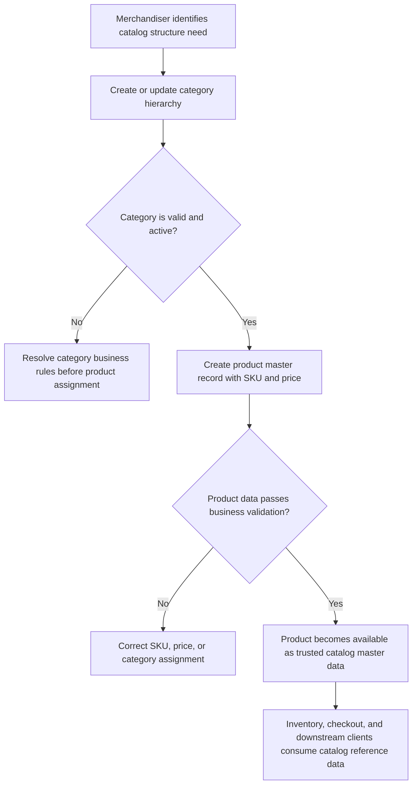

# Business Requirements Document (BRD) - Product Catalog Service
**Version:** 1.0 (Stable Milestone)
**Product Version:** 1.0

---

## 1. Business Objectives & Goals
The Product Catalog Service is the foundational core of the modular ERP platform. Its primary objective is to manage hierarchical product groupings (Categories) and the metadata of standard products (Products) sold by the enterprise.

* **Objective 1:** Establish a single source of truth for the product master data.
* **Objective 2:** Standardize inventory categorization for accurate downstream financial and supply chain reporting.
* **Objective 3:** Enable real-time, low-latency search and listing of products across active channels.

---

## 2. Stakeholders & Roles
* **Merchandisers:** Responsible for category definitions, creating/updating products, and configuring tags.
* **Inventory Managers:** Consume the product master database to track physical stock movements.
* **Downstream API Clients:** Third-party e-commerce channels or internal checkout gateways querying product details.

---

## 3. Scope Boundaries

### In-Scope
* Creating, reading, updating, and deleting (CRUD) product categories.
* Self-referencing subcategories (up to 3 levels deep).
* Standard product master CRUD (SKU, name, base price, category relationship).
* Auto-generation of SEO-friendly slugs for categories and products.

### Out-of-Scope
* Shopping cart logic or order management (owned by the Order/Checkout Service).
* Stock inventory level tracking (owned by the Inventory Service).
* Multi-currency rate conversion or tax calculation engines.

---

## 4. Core Business Entities

### Entity A: Category
A logic group to classify products. Must have:
* **Unique Slug:** Auto-generated unique identifier for routing and lookups (e.g., `electronics-accessories`).
* **Name:** Clean, user-facing label.

### Entity B: Product
A specific item offered for sale. Must have:
* **SKU (Stock Keeping Unit):** Strict unique alphanumeric code (e.g., `PROD-CAT-001`).
* **Price:** Base cost of the item, which cannot be negative.

---

## 5. Business Flow Diagrams

### Flow A: Category Setup and Product Onboarding

This diagram shows the business process and decision points only. Technical APIs, database operations, and UI implementation details belong in Architecture, ROADMAP, or codebase documentation.
