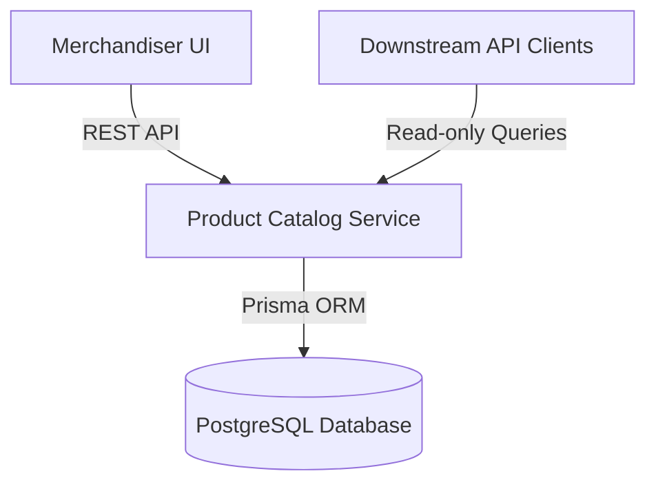
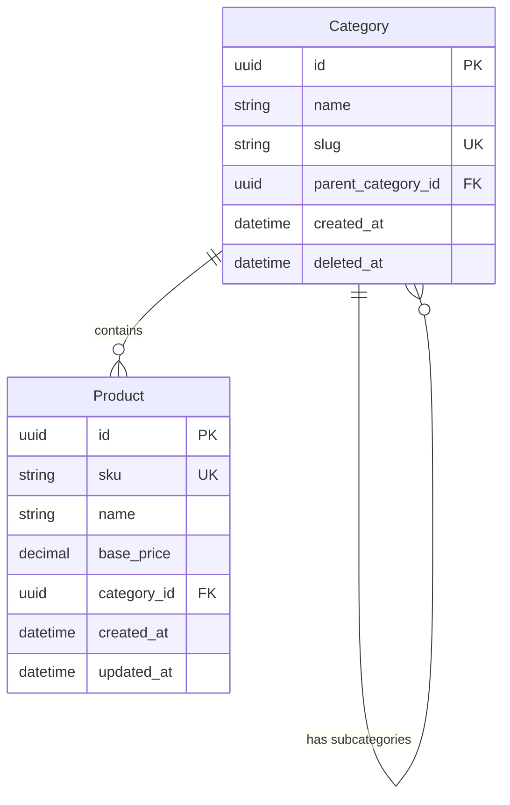
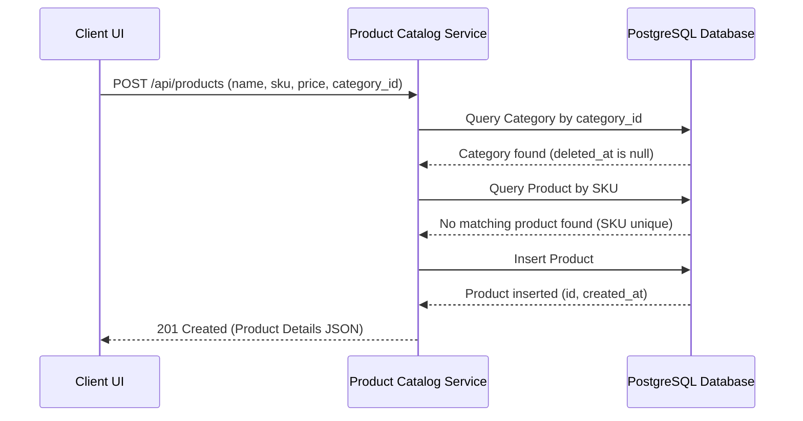

# Technical Architecture - Product Catalog Service
**Version:** 1.0 (Stable Milestone)
**Product Version:** 1.0

## 1. System Context & Boundaries
The Product Catalog Service is a central microservice (Pattern A) interacting with merchandiser frontends and e-commerce clients. It owns category and product schemas and publishes core catalogue data.

## 2. Component Diagram

## 3. Entity Relationship Diagram (ERD)
The database schema consists of a self-referencing `Category` table and a `Product` table connected by a one-to-many relationship:

## 4. Sequence Diagrams & Integration Flows
This diagram traces the flow for creating a new product, enforcing category checks and SKU uniqueness constraints:

## 5. Technical Constraints & Design Choices
* **Database & ORM:** PostgreSQL is used with Prisma ORM. Prisma models enforce relational integrity.
* **Input Validation:** Enforced at the route-layer using NestJS DTO class-validators.
* **Deletion Policy:** Deleting a category sets the `deleted_at` timestamp. Historical associations are preserved; new creations are blocked.
