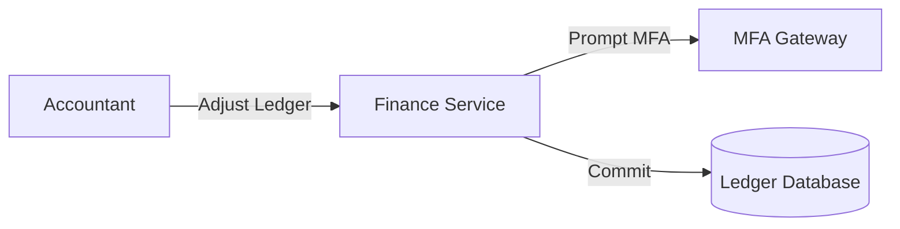

# Architecture Spec - Finance Domain
**Specification Boundary:** Finance

---

## 1. Boundary Integrations
The finance domain interfaces with the multi-factor auth gateway to authorize ledger updates.

