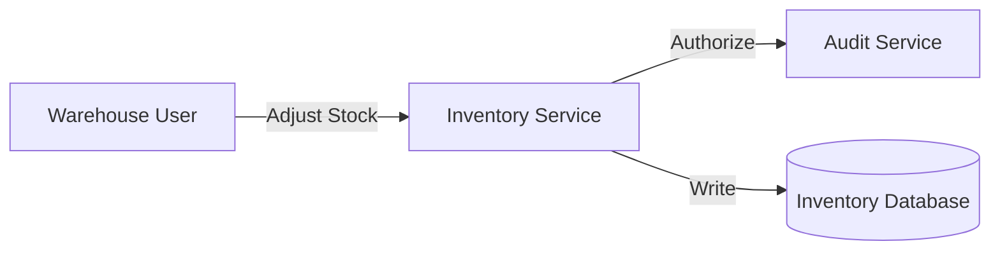

# Architecture Spec - Inventory Domain
**Specification Boundary:** Inventory

---

## 1. Boundary Integrations
The inventory domain interfaces with the physical inventory hardware devices and logs access control events to the audit service.

